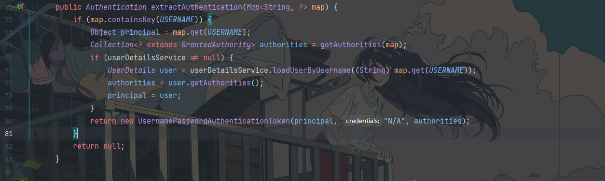

# spring-security-oauth2学习

## 密码模式

> 用户提供username,password,clientId,clientSecret，grantType=password等信息，请求/oauth/token，获得access_token，用户即可通过access_token访问资源

#### 1.认证服务器配置创建ClientCredentialsTokenEndpointFilter 过滤器 

```txt
	/**
     * 主要是让/oauth/token支持client_id和client_secret做登陆认证如果开启了allowFormAuthenticationForClients	          *
     * 那么就在BasicAuthenticationFilter之前添加ClientCredentialsTokenEndpointFilter
     */
	security.allowFormAuthenticationForClients();
```

源码:


此时在FilterChainProxy的filter中,重要的Filter有ClientCredentialsTokenEndpointFilter和BasicAuthenticationFilter，前者从request parameters中抽取client信息，后者从header Authorization Basic XXXX中抽取client信息。

**ClientCredentialsTokenEndpointFilter**会从parameter中抽取client_id,client_secret信息，并进行client的身份验证。


如果请求参数中没有参数中没有client_id,将会自动跳过ClientCredentialsTokenEndpointFilter,**BasicAuthenticationFilter**会获取header中的Authorization Basic，提取出客户端信息。

```java
	@Override
	protected void doFilterInternal(HttpServletRequest request,
			HttpServletResponse response, FilterChain chain)
					throws IOException, ServletException {
		final boolean debug = this.logger.isDebugEnabled();
 
		String header = request.getHeader("Authorization");
 
		if (header == null || !header.startsWith("Basic ")) {
			chain.doFilter(request, response);
			return;
		}
  
		try {
            // Base64 反解码
			String[] tokens = extractAndDecodeHeader(header, request);
			assert tokens.length == 2;
 
			String username = tokens[0];
 
 
			if (authenticationIsRequired(username)) {
				UsernamePasswordAuthenticationToken authRequest = new UsernamePasswordAuthenticationToken(
						username, tokens[1]);
				authRequest.setDetails(
						this.authenticationDetailsSource.buildDetails(request));
				Authentication authResult = this.authenticationManager
						.authenticate(authRequest);
 
		
 
				SecurityContextHolder.getContext().setAuthentication(authResult);
 
				this.rememberMeServices.loginSuccess(request, response, authResult);
 
				onSuccessfulAuthentication(request, response, authResult);
			}
 
		}
		catch (AuthenticationException failed) {
			 ...
		}
 
		chain.doFilter(request, response);
	}
```

无论是哪一种方式访问/oauth/token，都事先验证了**client**信息，并作为**authentication**存储在**SecurityContextHolder**中。传递到**TokenEndPoint**的**principal**是**client**，**paramters**包含了**user**的信息和**grantType**。


#### 2.访问TokenEndpoint(/oauth/token)

- TokenEndpoint收到请求时，会执行

  ```java
  ClientDetails authenticatedClient = getClientDetailsService().loadClientByClientId(clientId);
  ```

  通过ClientDetailsService和clientId获取**ClientDetails**。(pigx中拓展了JdbcClientDetailsService,通过自动装配,使用自定义的PigxClientDetailsServiceImpl替代了JdbcClientDetailsService,其中PigxClientDetailsServiceImpl的loadClientByClientId方法支持redis缓存,缓存中存在当前客户端信息时会从缓存中获取客户端信息,缓存中不存在客户端信息时,会通过feign接口调用upms接口获取客户端信息,最终将接口返回的数据适配成oauth2内置类型返回。这里redis缓存会根据租户id区分)

  ```java
  	//认证服务器配置
  	@Override
  	@SneakyThrows
  	public void configure(ClientDetailsServiceConfigurer clients) {
  		clients.withClientDetails(pigxClientDetailsServiceImpl);
  	}
  ```

  

- 通过传递进来的参数和查询出来的第三方应用信息构建**TokenRequest**


- 通过TokenRequest和grantType创建OAuth2AccessToken,最终写入响应。

  

  其中CompositeTokenGranter会遍历默认的五种情况，根据grant_type生成accessToken.


59到第63行是重新获取一下clientId和客户端信息（因为之前已经调用过该重写的该接口,会直接在缓存中获取客户端信息）跟授权类型再做一个校验,67行的**getAccessToken**方法会产生最终的一个令牌。

```java
	protected OAuth2AccessToken getAccessToken(ClientDetails client, TokenRequest tokenRequest) {
		return tokenServices.createAccessToken(getOAuth2Authentication(client, tokenRequest));
	}
```

其中**getAccessToken**中包含了**getOAuth2Authentication**方法.

​	1: 先获取OAuth2Authentication

​		密码模式使用**ResourceOwnerPasswordTokenGranter**实现类的**getOAuth2Authentication**方法**。getOAuth2Authentication**方法如下:


根据用户名和密码创建UsernamePasswordAuthenticationToken,然后调用了authenticationManager认证,这里调用的实现类是ProviderManager。


通过遍历List<AuthenticationProvider> providers ，最终调用了AbstractUserDetailsAuthenticationProvider的authenticate方法


首先通过username在缓存中获取用户,user为null的时候调用实现类DaoAuthenticationProvider的retrieveUser方法,通过UserDetailsService的loadUserByUsername获取用户信息并返回(最终调用的是PigxUserDetailsServiceImpl————自动装配且在认证服务器的configure(AuthorizationServerEndpointsConfigurer endpoints) 中配置.userDetailsService(pigxUserDetailsService), loadUserByUsername会现在缓存中查询用户信息,没有的话调用feign接口查询然后存到缓存并返回)。


最终AbstractUserDetailsAuthenticationProvider调用createSuccessAuthentication方法返回Authentication。ResourceOwnerPasswordTokenGranter通过 getRequestFactory().createOAuth2Request(client, tokenRequest); 生成OAuth2Request，最终和Authentication创建出OAuth2Authentication返回。


2.最最终tokenServices调用createAccessToken方法生成OAuth2AccessToken，一旦OAuth2AccessToken生成成功写入响应进行返回那么整个流程也就结束了，最终我们就拿到了想要的访问令牌。

```java
	@Transactional
	public OAuth2AccessToken createAccessToken(OAuth2Authentication authentication) throws AuthenticationException {
		/**
		  首先这个类一进来就会尝试在tokenStore中获取accessToken,因为同一个用户只要令牌没过期那么再次请求令牌的时候会把之前发           送的令牌再次发还。因此一开始就会找当前用户已经存在的令牌。
		  如果已经发送的令牌不为空,那么会在87行判断当前的令牌是否已经过期,如果令牌过期了，那么就会在tokenStore里把				  accessToken和refreshToken一起删掉,如果令牌没过期，那么就把这个没过期的令牌重新再存一下。因为可能用户是使用另外的			方式来访问令牌的，比如说一开始用授权码模式，后来用密码模式,而这两种模式需要存的信息是不一样的,所以这个令牌要重新store			一次。之后直接返回这个不过期的令牌。
		*/
		OAuth2AccessToken existingAccessToken = tokenStore.getAccessToken(authentication);
		OAuth2RefreshToken refreshToken = null;
		if (existingAccessToken != null) {
			if (existingAccessToken.isExpired()) {
				if (existingAccessToken.getRefreshToken() != null) {
					refreshToken = existingAccessToken.getRefreshToken();
					// The token store could remove the refresh token when the
					// access token is removed, but we want to
					// be sure...
					tokenStore.removeRefreshToken(refreshToken);
				}
				tokenStore.removeAccessToken(existingAccessToken);
			}
			else {
				// Re-store the access token in case the authentication has changed
				tokenStore.storeAccessToken(existingAccessToken, authentication);
				return existingAccessToken;
			}
		}

		//如果令牌已经过期了或者说这个是第一次请求，令牌压根没生成，就会走下面的逻辑。
        //首先看看刷新的令牌有没有，如果刷新的令牌没有的话，那么创建一枚刷新的令牌。然后在121行根据authentication, 				  refreshToken创建accessToken。而这个创建accessToken的方法也非常简单：
		if (refreshToken == null) {
			refreshToken = createRefreshToken(authentication);
		}
		// But the refresh token itself might need to be re-issued if it has
		// expired.
		else if (refreshToken instanceof ExpiringOAuth2RefreshToken) {
			ExpiringOAuth2RefreshToken expiring = (ExpiringOAuth2RefreshToken) refreshToken;
			if (System.currentTimeMillis() > expiring.getExpiration().getTime()) {
				refreshToken = createRefreshToken(authentication);
			}
		}

		OAuth2AccessToken accessToken = createAccessToken(authentication, refreshToken);
		tokenStore.storeAccessToken(accessToken, authentication);
		// In case it was modified
		refreshToken = accessToken.getRefreshToken();
		if (refreshToken != null) {
			tokenStore.storeRefreshToken(refreshToken, authentication);
		}
		return accessToken;

	}
```

```java
private OAuth2AccessToken createAccessToken(OAuth2Authentication authentication, OAuth2RefreshToken refreshToken) {
    DefaultOAuth2AccessToken token = new DefaultOAuth2AccessToken(UUID.randomUUID().toString());
    int validitySeconds = getAccessTokenValiditySeconds(authentication.getOAuth2Request());
    if (validitySeconds > 0) {
        token.setExpiration(new Date(System.currentTimeMillis() + (validitySeconds * 1000L)));
    }
    token.setRefreshToken(refreshToken);
    token.setScope(authentication.getOAuth2Request().getScope());

    return accessTokenEnhancer != null ? accessTokenEnhancer.enhance(token, authentication) : token;
}
```

> OAuth2AccessToken其实就是用UUID创建一个accessToken,然后把过期时间，刷新令牌和scope这些OAuth协议规定的必须要存在的参数设置上，设置完了以后它会判断是否存在tokenEnhancer，如果存在tokenEnhancer它就会按照定制的**tokenEnhancer**增强生成出来的token。
>
> 拿到返回的令牌之后，在122行createAccessToken方法中tokenStore会把拿到的令牌存起来,然后拿refreshToken存起来，最后把生成的令牌返回回去。

其中,pig中重写了token发放逻辑,并且在认证服务器configure(AuthorizationServerEndpointsConfigurer endpoints)中配置了tokenServices为PigxCustomTokenServices，支持多终端的唯一性登录并且实现了自定义的token增强。

#### 3.携带token访问资源服务器

> 当用户携带 token 请求资源服务器的资源时, **OAuth2AuthenticationProcessingFilter** 拦截 token，进行 token 和 userdetails 过程，把无状态的 token 转化成用户信息。

OAuth2AuthentiactionProcessingFilter，从request中提取access_token，构建PreAuthenticatedAuthenticationToken并验证。

其中tokenExtractor.extract(request)应该调用的是BearTokenExtractor里的extract方法，从Authorization header   “Bearer  xxxx”中抽取token，或者从request parameters抽取名为“access_token”的参数值。而pig中PigxBearerTokenExtractor实现了BearerTokenExtractor,extract方法对公开权限的请求不进行校验

```java
public void doFilter(ServletRequest req, ServletResponse res, FilterChain chain) throws IOException,
			ServletException {

		final boolean debug = logger.isDebugEnabled();
		final HttpServletRequest request = (HttpServletRequest) req;
		final HttpServletResponse response = (HttpServletResponse) res;

		try {

			Authentication authentication = tokenExtractor.extract(request);
			
			if (authentication == null) {
				if (stateless && isAuthenticated()) {
					if (debug) {
						logger.debug("Clearing security context.");
					}
					SecurityContextHolder.clearContext();
				}
				if (debug) {
					logger.debug("No token in request, will continue chain.");
				}
			}
			else {
				request.setAttribute(OAuth2AuthenticationDetails.ACCESS_TOKEN_VALUE, authentication.getPrincipal());
				if (authentication instanceof AbstractAuthenticationToken) {
					AbstractAuthenticationToken needsDetails = (AbstractAuthenticationToken) authentication;
					needsDetails.setDetails(authenticationDetailsSource.buildDetails(request));
				}
				Authentication authResult = authenticationManager.authenticate(authentication);

				if (debug) {
					logger.debug("Authentication success: " + authResult);
				}

				eventPublisher.publishAuthenticationSuccess(authResult);
				SecurityContextHolder.getContext().setAuthentication(authResult);

			}
		}
		catch (OAuth2Exception failed) {
			SecurityContextHolder.clearContext();

			if (debug) {
				logger.debug("Authentication request failed: " + failed);
			}
			eventPublisher.publishAuthenticationFailure(new BadCredentialsException(failed.getMessage(), failed),
					new PreAuthenticatedAuthenticationToken("access-token", "N/A"));

			authenticationEntryPoint.commence(request, response,
					new InsufficientAuthenticationException(failed.getMessage(), failed));

			return;
		}

		chain.doFilter(request, response);
	}

```

构建后的authentication再根据**OAuth2AuthenticationManager**验证该authentication的合法性。


OAuth2AuthenticationManager怎么验证呢?他调用了RemoteTokenServices.loadAuthentication ,执行所谓的 **check-token** 过程。


checkToken源码如下:


CheckToken 调用 redisTokenStore 查询 token 的合法性，及其返回用户的部分信息 （username )。

调用返回到RemoteTokenServices中,tokenConverter.extractAuthentication 解析组装服务端返回的信息。


然后调用最重要的 userTokenConverter.extractAuthentication(map);判断是否有 userDetailsService 实现，如果有 的话去查根据 返回的 username 查询一次全部的用户信息，没有实现直接返回 username 。

上述过程执行完成,流程便结束了。在pig中资源服务器支持本地模式。省去了调用远程服务器checkToken的过程

## 拓展

#### 1.个性化token

- 扩展生成包含业务信息的Token(如下),避免系统多次调用，直接可以通过认证接口获取到用户信息等，大大提高系统性能

```java
{
    "access_token":"a6f3b6d6-93e6-4eb8-a97d-3ae72240a7b0",
    "token_type":"bearer",
    "refresh_token":"710ab162-a482-41cd-8bad-26456af38e4f",
    "expires_in":42396,
    "scope":"server",
    "tenant_id":1,
    "license":"made by pigx",
    "dept_id":1,
    "user_id":1,
    "username":"admin"
}
```

通过前面的分析我们知道,OAuth2AccessToken是在AbstractTokenGranter中通过调用getAccessToken方法最终调用DefaultTokenServices的createAccessToken方法生成的,

createAccessToken 核心逻辑:

```java
// 默认刷新token 的有效期
private int refreshTokenValiditySeconds = 60 * 60 * 24 * 30; // default 30 days.
// 默认token 的有效期
private int accessTokenValiditySeconds = 60 * 60 * 12; // default 12 hours.

private OAuth2AccessToken createAccessToken(OAuth2Authentication authentication, OAuth2RefreshToken refreshToken) {
    DefaultOAuth2AccessToken token = new DefaultOAuth2AccessToken(uuid);
    token.setExpiration(Date)
    token.setRefreshToken(refreshToken);
    token.setScope(authentication.getOAuth2Request().getScope());
    return accessTokenEnhancer != null ? accessTokenEnhancer.enhance(token, authentication) : token;
}
```

如上代码，在拼装好token对象后会调用认证服务器配置TokenEnhancer( 增强器) 来对默认的token进行增强。

```java
public OAuth2AccessToken enhance(OAuth2AccessToken accessToken, OAuth2Authentication authentication) {
    final Map<String, Object> additionalInfo = new HashMap<>(8);
    PigxUser pigxUser = (PigxUser) authentication.getUserAuthentication().getPrincipal();
    additionalInfo.put("user_id", pigxUser.getId());
    additionalInfo.put("username", pigxUser.getUsername());
    additionalInfo.put("dept_id", pigxUser.getDeptId());
    additionalInfo.put("tenant_id", pigxUser.getTenantId());
    additionalInfo.put("license", SecurityConstants.PIGX_LICENSE);
    ((DefaultOAuth2AccessToken) accessToken).setAdditionalInformation(additionalInfo);
    return accessToken;
}
```

#### 2.扩展资源服务器解决oauth2 性能瓶颈

​	认证服务器check-token 返回的全部信息,资源服务器在根据返回信息组装用户信息的时候，只是用了username，如果设置了 userDetailsService 的实现则去调用 loadUserByUsername 再去查询一次用户信息，对性能产生不必要的影响

SO: 扩展UserAuthenticationConverter 的解析过程，把认证服务器返回的信息全部组装到spring security的上下文对象中

```java
/**
 * @author lengleng
 * @date 2019-03-07
 * <p>
 * 根据checktoken 的结果转化用户信息
 */
public class PigxUserAuthenticationConverter implements UserAuthenticationConverter {
	private static final String N_A = "N/A";
    // map 是check-token 返回的全部信息
	@Override
	public Authentication extractAuthentication(Map<String, ?> map) {
		if (map.containsKey(USERNAME)) {
			Collection<? extends GrantedAuthority> authorities = getAuthorities(map);

			String username = (String) map.get(USERNAME);
			Integer id = (Integer) map.get(SecurityConstants.DETAILS_USER_ID);
			Integer deptId = (Integer) map.get(SecurityConstants.DETAILS_DEPT_ID);
			Integer tenantId = (Integer) map.get(SecurityConstants.DETAILS_TENANT_ID);
			PigxUser user = new PigxUser(id, deptId, tenantId, username, N_A, true
					, true, true, true, authorities);
			return new UsernamePasswordAuthenticationToken(user, N_A, authorities);
		}
		return null;
	}
}
```

并且给remoteTokenServices 注入这个实现

```java
public class PigxResourceServerConfigurerAdapter extends ResourceServerConfigurerAdapter {

	@Override
	public void configure(ResourceServerSecurityConfigurer resources) {
		DefaultAccessTokenConverter accessTokenConverter = new DefaultAccessTokenConverter();
		UserAuthenticationConverter userTokenConverter = new PigxUserAuthenticationConverter();
		accessTokenConverter.setUserTokenConverter(userTokenConverter);

		remoteTokenServices.setRestTemplate(lbRestTemplate);
		remoteTokenServices.setAccessTokenConverter(accessTokenConverter);
		resources.
				.tokenServices(remoteTokenServices);
	}
}

```

#### 3.登录互踢(单一终端的唯一性登录)

重写发放逻辑`createAccessToken`，当用户管理的令牌存在时则删除重新创建，这样会导致之前登陆获取的token 失效，顺理成章的被挤掉。

```java
@Transactional
	public OAuth2AccessToken createAccessToken(OAuth2Authentication authentication) throws AuthenticationException {

		OAuth2AccessToken existingAccessToken = tokenStore.getAccessToken(authentication);
		OAuth2RefreshToken refreshToken = null;
		// 重写此处，当用户关联的token 存在时，删除原有令牌
		if (existingAccessToken != null) {
			tokenStore.removeAccessToken(existingAccessToken);
		}
		else if (refreshToken instanceof ExpiringOAuth2RefreshToken) {
			ExpiringOAuth2RefreshToken expiring = (ExpiringOAuth2RefreshToken) refreshToken;
			if (System.currentTimeMillis() > expiring.getExpiration().getTime()) {
				refreshToken = createRefreshToken(authentication);
			}
		}

		OAuth2AccessToken accessToken = createAccessToken(authentication, refreshToken);
		tokenStore.storeAccessToken(accessToken, authentication);
		// In case it was modified
		refreshToken = accessToken.getRefreshToken();
		if (refreshToken != null) {
			tokenStore.storeRefreshToken(refreshToken, authentication);
		}
		return accessToken;
	}
```

#### 4.多端唯一性登录

先来看上文源码 `OAuth2AccessToken existingAccessToken=tokenStore.getAccessToken(authentication); `是如何根据用户信息判断 token 存在的呢？

```java
public OAuth2AccessToken getAccessToken(OAuth2Authentication authentication) {
		String key = authenticationKeyGenerator.extractKey(authentication);
		  // redis 查询逻辑，根据 key
		return accessToken;
    
}
```

- AuthenticationKeyGenerator key值生成器 默认情况下根据 `username`/`clientId`/`scope` 参数组合生成唯一token

```java
public String extractKey(OAuth2Authentication authentication) {
	Map<String, String> values = new LinkedHashMap<String, String>();
	OAuth2Request authorizationRequest = authentication.getOAuth2Request();
	if (!authentication.isClientOnly()) {
		values.put(USERNAME, authentication.getName());
	}
	values.put(CLIENT_ID, authorizationRequest.getClientId());
	if (authorizationRequest.getScope() != null) {
		values.put(SCOPE, OAuth2Utils.formatParameterList(new TreeSet<String>(authorizationRequest.getScope())));
	}
	return generateKey(values);
}
```

- 若想实现，多终端的唯一性登录，只需要使得同一个用户在多个终端生成的 `token` 一致，加上上文提到的 createToken 修改逻辑,既去掉`extractKey` 的 clientId 条件，不区分终端即可

```java
public String extractKey(OAuth2Authentication authentication) {
	Map<String, String> values = new LinkedHashMap<String, String>();
	OAuth2Request authorizationRequest = authentication.getOAuth2Request();
	if (!authentication.isClientOnly()) {
		values.put(USERNAME, authentication.getName());
	}
	if (authorizationRequest.getScope() != null) {
		values.put(SCOPE, OAuth2Utils.formatParameterList(new TreeSet<String>(authorizationRequest.getScope())));
	}
	return generateKey(values);
}
```

- 最后在 authserver 中注入新的 TokenService 即可

## 参考资料

[pig:基于Spring Boot 2.5、 Spring Cloud 2020 & Alibaba、 OAuth2 的微服务RBAC 权限管理系统。](https://gitee.com/log4j/pig)

[冷冷沉思录-oschina](https://my.oschina.net/giegie)

