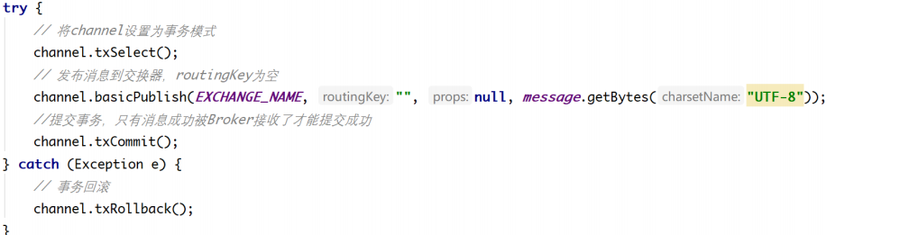

# RabbitMQ消息队列

## 初识RabbitMQ

### 介绍

> 		RabbitMQ是一套开源（MPL）的消息队列服务软件，是由 LShift 提供的一个 Advanced Message Queuing Protocol (AMQP) 的开源实现，由以高性能、健壮以及可伸缩性出名的 Erlang 写成。

#### RabbitMQ核心思想

> 接受并转发消息。

> 例子：你可以把它想象成一个邮局、

#### RabbitMQ特点

**可靠性**:

> RabbitMQ使用一些机制来保证可靠性， 如持久化、传输确认及发布确认等。

**灵活的路由** : 

> 在消息进入队列之前，通过交换器来路由消息。对于典型的路由功能， RabbitMQ 己经提供了一些内置的交换器来实现。针对更复杂的路由功能，可以将多个 交换器绑定在一起， 也可以通过插件机制来实现自己的交换器。

**扩展性**: 

> 多个RabbitMQ节点可以组成一个集群，也可以根据实际业务情况动态地扩展 集群中节点。

**高可用性** : 

> 队列可以在集群中的机器上设置镜像，使得在部分节点出现问题的情况下队 列仍然可用。

**多种协议**: 

> RabbitMQ除了原生支持AMQP协议，还支持STOMP， MQTT等多种消息 中间件协议。

**多语言客户端** :

> RabbitMQ 几乎支持所有常用语言，比如 Java、 Python、 Ruby、 PHP、 C#、 JavaScript 等。

**管理界面** : 

> RabbitMQ 提供了一个易用的用户界面，使得用户可以监控和管理消息、集 群中的节点等。

**令插件机制** : 

> RabbitMQ 提供了许多插件 ， 以实现从多方面进行扩展，当然也可以编写自 己的插件

###  RabbitMQ 使用场景

#### 1. 解耦

**（为面向服务的架构（SOA）提供基本的最终一致性实现）**

场景说明：用户下单后，订单系统需要通知库存系统。传统的做法是，订单系统调用库存系统的接口。


传统模式的缺点：

- 假如库存系统无法访问，则订单减库存将失败，从而导致订单失败
- 订单系统与库存系统耦合

引入消息队列


- 订单系统：用户下单后，订单系统完成持久化处理，将消息写入消息队列，返回用户订单下单成功
- 库存系统：订阅下单的消息，采用拉/推的方式，获取下单信息，库存系统根据下单信息，进行库存操作
- 假如：在下单时库存系统不能正常使用。也不影响正常下单，因为下单后，订单系统写入消息队列就不再关心其他的后续操作了。实现订单系统与库存系统的应用解耦
- 为了保证库存肯定有，可以将队列大小设置成库存数量，或者采用其他方式解决。

基于消息的模型，关心的是“通知”，而非“处理”。

短信、邮件通知、缓存刷新等操作使用消息队列进行通知。


消息队列和RPC的区别与比较：

RPC: 异步调用，及时获得调用结果，具有强一致性结果，关心业务调用处理结果。

消息队列：两次异步RPC调用，将调用内容在队列中进行转储，并选择合适的时机进行投递（错峰流控）

#### 2. 异步提升效率

场景说明：用户注册后，需要发注册邮件和注册短信。传统的做法有两种 1.串行的方式；2.并行方式

（1）串行方式：将注册信息写入数据库成功后，发送注册邮件，再发送注册短信。以上三个任务全部完成后，返回给客户端


（2）并行方式：将注册信息写入数据库成功后，发送注册邮件的同时，发送注册短信。以上三个任务完成后，返回给客户端。与串行的差别是，并行的方式可以提高处理的时间


（3）引入消息队列，将不是必须的业务逻辑，异步处理。改造后的架构如下：


#### 3. 流量削峰

流量削锋也是消息队列中的常用场景，一般在秒杀或团抢活动中使用广泛

应用场景：系统其他时间A系统每秒请求量就100个，系统可以稳定运行。系统每天晚间八点有秒杀活动，每秒并发请求量增至1万条，但是系统最大的处理能力只能每秒处理1000个请求，于是系统崩溃，服务器宕机。

之前架构：大量用户（100万用户）通过浏览器在晚上八点高峰期同时参与秒杀活动。大量的请求涌入我们的系统中，高峰期达到每秒钟5000个请求，大量的请求打到MySQL上，每秒钟预计执行3000条SQL。但是一般的MySQL每秒钟扛住2000个请求就不错了，如果达到3000个请求的话可能MySQL直接就瘫痪了，从而系统无法被使用。但是高峰期过了之后，就成了低峰期，可能也就1万用户访问系统，每秒的请求数量也就50个左右，整个系统几乎没有任何压力。

引入MQ：100万用户在高峰期的时候，每秒请求有5000个请求左右，将这5000请求写入MQ里面，系统A每秒最多只能处理2000请求，因为MySQL每秒只能处理2000个请求。系统A从MQ中慢慢拉取请求，每秒就拉取2000个请求，不要超过自己每秒能处理的请求数量即可。MQ，每秒5000个请求进来，结果只有2000个请求出去，所以在秒杀期间（将近一小时）可能会有几十万或者几百万的请求积压在MQ中。这个短暂的高峰期积压是没问题的，因为高峰期过了之后，每秒就只有50个请求进入MQ了，但是系统还是按照每秒2000个请求的速度在处理，所以说，只要高峰期一过，系统就会快速将积压的消息消费掉。我们在此计算一下，每秒在MQ积压3000条消息，1分钟会积压18万，1小时积压1000万条消息，高峰期过后，1个多小时就可以将积压的1000万消息消费掉。


### 引入消息队列的优缺点

#### 优点

优点就是以上的那些场景应用，就是在特殊场景下有其对应的好处，**解耦**、**异步**、**削峰**。

#### 缺点

- 系统的可用性降低
  系统引入的外部依赖越多，系统越容易挂掉，本来只是A系统调用BCD三个系统接口就好，ABCD四个系统不报错整个系统会正常运行。引入了MQ之后，虽然ABCD系统没出错，但MQ挂了以后，整个系统也会崩溃。
- 系统的复杂性提高
  引入了MQ之后，需要考虑的问题也变得多了，如何保证消息没有重复消费？如何保证消息不丢失？怎么保证消息传递的顺序？
- 一致性问题
  A系统发送完消息直接返回成功，但是BCD系统之中若有系统写库失败，则会产生数据不一致的问题。

### RabbitMQ名词

[producer]() 

> 生产者


[queue]()

> 队列 


[consumer]() 

> 消费者 


> 它们之间的关系就是


### RabbitMQ核心概念


#### 服务

> server：服务

#### 连接

> **connection**：与server建立连接

#### 信道

> **channel**：信道，几乎所有操作都在信道上进行，客户端可以建立多个信道

#### 消息

> **message**：消息，有[properties]()（属性配置）和[body]()（实体，具体的消息）组成

#### 虚拟主机

> **virtual host**: 虚拟主机，顶层隔离。同一个虚拟主机下，不能有重复的交换机和[queue]()

#### 交换机

> **Exchange**: 交换机，接受生产者的消息，然后根据制定的路由器去吧消息转发到所绑定的队列上

#### 绑定

> **binding**：绑定交换机和队列

#### 路由键

> **routing key**：路由键，路由规则，虚拟机可以用它来确定这个消息如何进行一个路由

#### 队列

> **queue**：消费者只需要监听队列来消费的消息，不需要关注消息来自哪个[Exchange]()


[Exchange]()和[Message ]() Queu存在着绑定的关系，一个[Exchage]()可以绑定**多个**消息队列

#### 消息流转过程


	对于生产者，发送一个消息时，要指定一个路由键，然后Exchange拿到消息转发到消费这队列中去，根据路由键转发到那个路由，然后在做最后的一些列处理。

### 什么叫消息队列MQ

#### MQ

>  消息队列是一种跨进程的通信机制，具有单向传递、单向依赖和异步处理的特性，主要解决多个系统间的消息异步、业务解耦、流量削峰等问题。
>
>  消息队列从字面上意思是Message+Queue。Message是信息载体,特征是携带的消息通常具有“可消费”性质；Queue是一个单向通道，特征是先进先出。

#### 特性

> 业务无关、FIFO、容灾、性能

### 为什么要用消息队列

#### 优点

##### 系统解耦

> 例如，你正在开发电商模块系统，有几十个模块，如优惠券日志缓存地址等等，你就几个模块可以直接调用他们的api，但是你几十个模块，一个个调用就麻烦了，性能也就下去了，耦合度就高了。这是就可以用到消息队列了。
>
> 不易维护，如果以后上了两个模块又要重写改代码，不易维护。

##### 异步调用

> 例如，这是一个快递服务，生产者就是卖家 message就是快递 运输路线就queue 你就是消费者，生产者只需要关系制造的商品，快递不需要实时被签收，消费者有空的时候再取件

##### 流量削峰

> 当促销季，消费者购买的商品太多，快递服务可以提供的仓储功能，可以起到缓冲效果。

#### 缺点

##### 可用性降低

> 快递服务一旦瘫痪，商品消费业务就无法进行。

##### 业务复杂化增加

> 商品消费业务，原本是生产者与消费者两者之间的关系，现在有增加了第三方快递服务公司，完成一个商品消费业务复杂化增加。

##### 可能一致性问题

> 生产者通过快递服务发完货就完成了自身的业务，默认商品消费已经成功，但如果消费者对部分商品不满意，拒绝签收所有物品，那么实际上商品消费失败，生产者和消费者双方的数据就会不一致。

### AMQP协议

> Advanced Message Queuing Protocol

> RabbitMQ就是 AMQP 协议的 `Erlang` 的实现(当然 RabbitMQ 还支持 `STOMP2`、 `MQTT3` 等协议 ) AMQP 的模型架构 和 RabbitMQ 的模型架构是一样的，生产者将消息发送给交换器，交换器和队列绑定 。
>
> RabbitMQ 中的交换器、交换器类型、队列、绑定、路由键等都是遵循的 AMQP 协议中相 应的概念。目前 RabbitMQ 最新版本默认支持的是 AMQP 0-9-1。

#### 三层协议

**Module Layer**

> 协议最高层，主要定义了一些客户端调用的命令，客户端可以用这些命令实现自己的业务逻辑。

**Session Layer**

> 中间层，主要负责客户端命令发送给服务器，再将服务端应答返回客户端，提供可靠性同步机制和错误处理。

**TransportLayer**

> 最底层，主要传输二进制数据流，提供帧的处理、信道服用、错误检测和数据表示等。

#### AMQP模型的几大组件

- 交换器 (Exchange)：消息代理服务器中用于把消息路由到队列的组件。
- 队列 (Queue)：用来存储消息的数据结构，位于硬盘或内存中。
- 绑定 (Binding)：一套规则，告知交换器消息应该将消息投递给哪个队列。

#### 工作流程

> 发布者（Publisher）发布消息（Message），经由交换机（Exchange）。
>
> 交换机根据**路由规则**将收到的消息分发给与该交换机绑定的队列（Queue）。
>
> 最后 AMQP 代理会将消息投递给订阅了此队列的消费者，或者消费者按照需求自行获取。


## RabbitMQ的安装和启动

### Centos安装

#### 1、安装Erlang

> 安装Erlang-rpm包，改包经过RabbitMQ官方处理

##### **配置源**

```shell
vim /etc/yum.repos.d/rabbitmq-erlang.repo
```

按下i插入，把下面内容复制进去按esc 输入:wq 保存

```
[rabbitmq-erlang]
name=rabbitmq-erlang
baseurl=https://dl.bintray.com/rabbitmq-erlang/rpm/erlang/22/el/7
gpgcheck=1
gpgkey=https://dl.bintray.com/rabbitmq/Keys/rabbitmq-release-signing-key.asc
repo_gpgcheck=0
enabled=1
```

##### 清空缓存

```shell
yum clean all
```

##### 生成缓存

```shell
yum makecache
```

##### 执行安装Erlang

```shell
yum install erlang
```

### 2、安装RabbitMQ

##### 导入秘钥

```shell
rpm –import https://www.rabbitmq.com/rabbitmq-release-signing-key.asc
```

#####  下载RabbitMQ安装包

```shell
wget https://www.rabbitmq.com/releases/rabbitmq-server/v3.6.10/rabbitmq-server-3.6.10-1.el7.noarch.rpm
```

##### 安装

```shell
rpm -Uvh rabbitmq-server-3.6.10-1.el7.noarch.rpm
```

##### 启动

```shell
systemctl start rabbitmq-server
```

##### 开机引导

```shell
systemctl enable rabbitmq-server
```

##### 查看状态

```shell
systemctl status rabbitmq-server
```

## RabbitMQ管理后台

### 进入后台

启动`rabbitmq`管理后台插件

```shell
rabbitmq-plugins enable rabbitmq_management
```

现在需要登录就得先建立账号

```shell
rabbitmqctl add_user 用户名 密码
```

设置权限

```shell
rabbitmqctl set_user_tags 用户名 administrator
```

开放端口15672端口浏览器输入如下地址访问

[http:// ip:15672]()

ip指的是你的公网ip


登录后进入到主页


### 介绍后台


### 添加用户


### 创建虚拟主机


## 实战演示

### 简单使用RabbitMQ

>  需求，用户A生产消息，用户B拿到消息并打印出来。

####  创建工程

> 打开idea创建普通的maven工程


#### 导入依赖

> 导入rabbitmq的依赖

```xml
<!--rabbitmq依赖-->
<dependency>
    <groupId>com.rabbitmq</groupId>
    <artifactId>amqp-client</artifactId>
    <version>5.8.0</version>
</dependency>
<!--RabbitMQ日志依赖-->
<dependency>
    <groupId>org.slf4j</groupId>
    <artifactId>slf4j-nop</artifactId>
    <version>1.7.29</version>
</dependency>
```

#### 建生产者类

> 建立一个生产者类用于发送消息，连接rabbitmq服务端，发送消息退出

注意如果，使用默认的guest用远端登录是无法登录的，必须添加用户。

添加完用户必须，添加虚拟主机，默认的[Can access virtual hosts]()为 `/`

必须添加用户访问权限。


```java
/**
 * @author Herther
 * @version 1.0.0
 * @ClassName Send.java
 * @Description 发送消息，连接rabbitmq服务端，发送消息退出
 * @createTime 2021年07月27日 17:11:00
 */
public class Send {

    private final static String QUEUE_NAME = "hello";

    public static void main(String[] args) throws IOException, TimeoutException {
        //1、设置连接工厂
        ConnectionFactory factory = new ConnectionFactory();
        //2、RabbitMQ地址 //开启5672端口 rabbitmq的服务器端口
        //设置ip
        factory.setHost("47.107.119.123");
        //设置用户名
        factory.setUsername("herther");
        //设置密码
        factory.setPassword("123456");
        //3、建立连接
        Connection connection = factory.newConnection();
        //4、获得信道
        Channel channel = connection.createChannel();
        //5、声明队列  //参数：队列名字，是否需要持久，是不是独有是不是仅当前连接用户使用，是否自动删除队列，
        channel.queueDeclare(QUEUE_NAME,false,false,false,null);
        //6、发布消息
        String message ="我是消费者发送的消息。。。。";
        //参数：1交换机 2、路由键  3、配置文件  4、消息
        channel.basicPublish("",QUEUE_NAME,null,message.getBytes("UTF-8"));
        System.out.println("发送了消息，消息内容为："+message);
        //7、关闭连接
        channel.close();
        connection.close();
    }
}
```


#### 建立消费者类

> 接受发送者的消息并打印

```java
/**
 * @author Herther
 * @version 1.0.0
 * @ClassName Revc.java
 * @Description 消费者，接收到生产发送的消息并打印
 * @createTime 2021年07月27日 17:39:00
 */
public class Revc {
    private final static String QUEUE_NAME = "hello";

    public static void main(String[] args) throws IOException, TimeoutException {
        //设置工厂
        ConnectionFactory factory = new ConnectionFactory();
        //设置Rabbitmq地址
         //设置ip
        factory.setHost("47.107.119.123");
        //设置用户名
        factory.setUsername("herther");
        //设置密码
        factory.setPassword("123456");
        //建立连接
        Connection connection = factory.newConnection();
        //获得信道
        Channel channel = connection.createChannel();
        //声明队列
        channel.queueDeclare(QUEUE_NAME,false,false,false,null);
        //接受消息并消费
        //参数 队列名，是否自动确认收到，消息处理
        channel.basicConsume(QUEUE_NAME,true,new DefaultConsumer(channel){
            @Override
            public void handleDelivery(java.lang.String consumerTag, Envelope envelope, AMQP.BasicProperties properties, byte[] body) throws IOException {
                String message = new String(body, "utf-8");
                System.out.println("收到消息："+message);
            }
        });
    }
}
```


尝试多发送几次，再看看接受的


### 多个消费者的使用

#### 生产者

> 生产者发送多个消息任务

```java
/**
 * @author Herther
 * @version 1.0.0
 * @ClassName NewTask.java
 * @Description 生产者发送多个消息任务
 * @createTime 2021年07月27日 18:18:00
 */
public class NewTask {
    private static final String TASK_QUEUQ_NAME="TASK_QUEUE";

    public static void main(String[] args) throws IOException, TimeoutException {
        //建立工厂
        ConnectionFactory factory = new ConnectionFactory();
        //设置ip
        factory.setHost("47.107.119.123");
        //设置用户名
        factory.setUsername("herther");
        //设置密码
        factory.setPassword("123456");
        //建立连接
        Connection connection = factory.newConnection();
        //设置信道
        Channel channel = connection.createChannel();
        //设置队列
        channel.queueDeclare(TASK_QUEUQ_NAME,true,false,false,null);
        //发送消息
        for (int i = 1; i < 10 ; i++) {
            String message = "第" + i+ "消息.";
            channel.basicPublish("",TASK_QUEUQ_NAME,null,message.getBytes("UTF-8"));
        }
        System.out.println("发送完成");
        channel.close();
        connection.close();
    }

}
```


#### 消费者

> 消费者接收消息

```java
public class Worker {

    private static final String TASK_QUEUQ_NAME="TASK_QUEUE";

    public static void main(String[] args) throws IOException, TimeoutException {
        ConnectionFactory factory = new ConnectionFactory();
        //设置ip
         factory.setHost("47.107.119.123");
        //设置用户名
        factory.setUsername("herther");
        //设置密码
        factory.setPassword("123456");
        Connection connection = factory.newConnection();
        Channel channel = connection.createChannel();
        channel.queueDeclare(TASK_QUEUQ_NAME,true,false,false,null);
        channel.basicConsume(TASK_QUEUQ_NAME,true,new DefaultConsumer(channel){
            @Override
            public void handleDelivery(String consumerTag, Envelope envelope, AMQP.BasicProperties properties, byte[] body) throws IOException {
                String message = new String(body, "utf-8");
                System.out.println("开始接受消息");
                System.out.println("接受的消息为："+message);
                try {
                    doWork(message);
                }finally {
                    System.out.println("消息接受完毕");
                }
            }
        });
        
    }
    private static void doWork(String task) {
        char[] chars = task.toCharArray();
        for (char i :chars){
            if (i == '.'){
                try {
                    Thread.sleep(1000);
                } catch (InterruptedException e) {
                    e.printStackTrace();
                }
            }
        }
    }
}
```


### 多个消费者的平均压力

> 在运行多个消费，则可以加快了消费者的速度。在IDEA中打开`edit configurations`


> 然后点击`Modify options`


> 然后选择 `allow multiple instances` 然后点击apply完成即可。


> 运行了两个worker，即可分担消费者压力，现在开始生产消息查看。


> worker1 接收了1、3、6、9的消息 。worker2 接受了 2、4、6、8的消息


### 公平派遣

>    RabbitMQ 平等分发任务，可以注意到，工作者1（消费者1）的处理任务比较忙碌（消费耗时），而消费者2却有大量时间处于空闲状态不做任何任务。而 RabbitMQ 对此一无所知，进行平均分配消息，这是因为 RabbitMQ 在消息进入队列才进行信息调度，不会进行未确认消息数，只是盲目地将消息发送给消费者。

 为了解决这一点，可以使用 basicQos 方法并将入参参数设置为 1，这样做的意义是，RabbitMQ 一次不要给消费者一个以上的消息。换句话即是在消费者处理并确认上一条信息之前，不要向其发送新的消息，而是分派给不繁忙的消费者进行消费。

```
具体实现
```

```java
/**
 * @author Herther
 * @version 1.0.0
 * @ClassName Workr.java
 * @Description 消费者接收消息
 * @createTime 2021年07月27日 18:24:00
 */
public class Worker {

    private static final String TASK_QUEUQ_NAME="TASK_QUEUE";

    public static void main(String[] args) throws IOException, TimeoutException {
        ConnectionFactory factory = new ConnectionFactory();
        //设置ip
         factory.setHost("47.107.119.123");
        //设置用户名
        factory.setUsername("herther");
        //设置密码
        factory.setPassword("123456");
        Connection connection = factory.newConnection();
        Channel channel = connection.createChannel();
        channel.queueDeclare(TASK_QUEUQ_NAME,true,false,false,null);
        //告诉rabbitmq 我正在处理这一条任务，等我消费完再执行下一条
        channel.basicQos(1);
        channel.basicConsume(TASK_QUEUQ_NAME,false,new DefaultConsumer(channel){
            @Override
            public void handleDelivery(String consumerTag, Envelope envelope, AMQP.BasicProperties properties, byte[] body) throws IOException {
                String message = new String(body, "utf-8");
                System.out.println("开始接受消息");
                System.out.println("接受的消息为："+message);
                try {
                    doWork(message);
                }finally {
                    System.out.println("消息接受完毕");
                    //我任务完成可以执行下一个任务了
                    channel.basicAck(envelope.getDeliveryTag(),false);
                }
            }
        });
    }
    private static void doWork(String task) {
        char[] chars = task.toCharArray();
        for (char i :chars){
            if (i == '.'){
                try {
                    Thread.sleep(1000);
                } catch (InterruptedException e) {
                    e.printStackTrace();
                }
            }
        }
    }
}
```


> 通过设置 basicQos ，可以让 RabbitMQ 实现分轻重地对任务进行分派。

## 交换机工作模式

### 四种工作模式模式

#### 1、fanout

> fanout：广播模式，这种模式只需要将队列绑定交换机上即可，是不需要设置路由键的


> 临时队列


##### 案例

> 实现日志的发送

```
发送者
```

```java
/**
 * @author Herther
 * @version 1.0.0
 * @ClassName EmitLog.java
 * @Description 日志发送
 * @createTime 2021年07月28日 18:36:00
 */
public class EmitLog {

    //交换机名称
    private static final String EXCHANGE_NAME = "log";

    public static void main(String[] args) throws IOException, TimeoutException {
        ConnectionFactory factory = new ConnectionFactory();
        //设置Rabbitmq地址
        factory.setHost("47.107.119.225");
        factory.setUsername("herther");
        factory.setPassword("116826");
        //建立连接
        Connection connection = factory.newConnection();
        //获得信道
        Channel channel = connection.createChannel();
        //交换机 第一个参数交换机名字 第二个参数交换机类型
        channel.exchangeDeclare(EXCHANGE_NAME, BuiltinExchangeType.FANOUT);
        String message= "info: hello world";
        //交换机名字 路由键  配置  消息主体
        channel.basicPublish(EXCHANGE_NAME,"",null,message.getBytes(StandardCharsets.UTF_8));
        System.out.println("发送日志完成，日志消息为："+message);
        channel.close();
        connection.close();
    }
}
```

```
接收者，多个
```

```java
/**
 * @author Herther
 * @version 1.0.0
 * @ClassName ReceiveLogs.java
 * @Description 接受日志信息
 * @createTime 2021年07月28日 18:45:00
 */
public class ReceiveLogs {
    //交换机名称
    private static final String EXCHANGE_NAME = "log";

    public static void main(String[] args) throws IOException, TimeoutException {
        ConnectionFactory factory = new ConnectionFactory();
        //设置Rabbitmq地址
        factory.setHost("47.107.119.225");
        factory.setUsername("herther");
        factory.setPassword("116826");
        Connection connection = factory.newConnection();
        Channel channel = connection.createChannel();
        //生成临时队列
        String queueName = channel.queueDeclare().getQueue();
        //绑定交换机
        channel.queueBind(queueName, EXCHANGE_NAME, "");
        System.out.println("开始接受消息");
        DefaultConsumer consumer = new DefaultConsumer(channel) {
            @Override
            public void handleDelivery(String consumerTag, Envelope envelope, AMQP.BasicProperties properties, byte[] body) throws IOException {
                String message = new String(body, "utf-8");
                System.out.println("接受日志消息: " + message);
            }
        };
        channel.basicConsume(queueName, true,consumer);
    }
}
```

> 可以看到 只要与交换机绑定的队列，都会接收到消息，生产临时队列，在做日志的时候，有大批量的日志意味着有大批量队列，生产临时的队列就有了比较达的用处。


#### 2、direct

> direct：根据RoutingKey 匹配消息路由到指定的队列


> 交换机类型为direct，必须要根据路由键再能匹配到队列

> 场景业务: 把error的日志信息放入到磁盘的队列，把info warning error的错误在控制台打印的场景。


```
具体实现
```

生产者

```java
/**
 * @author Herther
 * @version 1.0.0
 * @ClassName EmitLogDirect.java
 * @Description 消息发送者，发送三种不同的日志消息
 * @createTime 2021年07月29日 14:08:00
 */
public class EmitLogDirect {

    private static final String EXCHANGE_NAME = "logs";

    public static void main(String[] args) throws IOException, TimeoutException {
        ConnectionFactory factory = new ConnectionFactory();
        //设置Rabbitmq地址
        factory.setHost("47.107.119.225");
        factory.setUsername("herther");
        factory.setPassword("116826");
        //建立连接
        Connection connection = factory.newConnection();
        //获得信道
        Channel channel = connection.createChannel();
        //交换机 第一个参数交换机名字 第二个参数交换机类型
        channel.exchangeDeclare(EXCHANGE_NAME, BuiltinExchangeType.DIRECT);
        String message_log = "This is a log";
        channel.basicPublish(EXCHANGE_NAME, "info", null, message_log.getBytes(StandardCharsets.UTF_8));
        System.out.println("发送消息成功，日志等级info，消息内容"+message_log);
        channel.basicPublish(EXCHANGE_NAME, "waring", null, message_log.getBytes(StandardCharsets.UTF_8));
        System.out.println("发送消息成功，日志等级waring，消息内容"+message_log);
        channel.basicPublish(EXCHANGE_NAME, "error", null, message_log.getBytes(StandardCharsets.UTF_8));
        System.out.println("发送消息成功，日志等级error，消息内容"+message_log);

        connection.close();
        channel.close();
    }
}
```

消费者1

```java
/**
 * @author Herther
 * @version 1.0.0
 * @ClassName DirectReceiveLogs1.java
 * @Description 接受三种日志消息
 * @createTime 2021年07月29日 14:17:00
 */
public class DirectReceiveLogs1 {

    private static final String EXCHANGE_NAME = "logs";

    public static void main(String[] args) throws IOException, TimeoutException {
        ConnectionFactory factory = new ConnectionFactory();
        //设置Rabbitmq地址
        factory.setHost("47.107.119.225");
        factory.setUsername("herther");
        factory.setPassword("116826");
        //建立连接
        Connection connection = factory.newConnection();
        Channel channel = connection.createChannel();
        String queueName = channel.queueDeclare().getQueue();
        //第一个参数交换机，第二个队列名称，第三个rotingkey
        channel.queueBind(queueName,EXCHANGE_NAME,"info");
        channel.queueBind(queueName,EXCHANGE_NAME,"waring");
        channel.queueBind(queueName,EXCHANGE_NAME,"error");
        channel.basicConsume(queueName, new DefaultConsumer(channel){
            @Override
            public void handleDelivery(String consumerTag, Envelope envelope, AMQP.BasicProperties properties, byte[] body) throws IOException {
                System.out.println("接收到消息为："+new String(body,"utf-8"));
            }
        });
    }
}
```

消费者2

```java
/**
 * @author Herther
 * @version 1.0.0
 * @ClassName DirectReceiveLogs1.java
 * @Description 只接受error消息
 * @createTime 2021年07月29日 14:17:00
 */
public class DirectReceiveLogs2 {

    private static final String EXCHANGE_NAME = "logs";

    public static void main(String[] args) throws IOException, TimeoutException {
        ConnectionFactory factory = new ConnectionFactory();
        //设置Rabbitmq地址
        factory.setHost("47.107.119.225");
        factory.setUsername("herther");
        factory.setPassword("116826");
        Connection connection = factory.newConnection();
        Channel channel = connection.createChannel();
        //生成临时队列
        String queueName = channel.queueDeclare().getQueue();
        //绑定交换机
        channel.queueBind(queueName, EXCHANGE_NAME, "error");
        DefaultConsumer consumer = new DefaultConsumer(channel) {
            @Override
            public void handleDelivery(String consumerTag, Envelope envelope, AMQP.BasicProperties properties, byte[] body) throws IOException {
                String message = new String(body, "utf-8");
                System.out.println("接受日志消息: " + message);
            }
        };
        channel.basicConsume(queueName, true,consumer);
    }
}
```


#### 3、topic

> topic：生产者指定RoutingKey 消息根据消费端指定的队列通过模糊匹配方式来进行相应的转发


- topic模式跟direct差不多，只是把type改一下就行。direct是把固定的routing_key跟queue绑定，topic是把模糊的routing_key跟queue绑定

topic的模糊匹配方式有两种

1. 用 `*`号可以替代一个单词
2. 用 `#`号可以替代零个或多个单词

由上图可知，q1队列接收的路由键就为，**只有一个** orange **只有一个** 的 

q2  前面**有两个单词**的rabbit，lazy 后面有**多个单词或没有**

```
具体实现
```

```java
/**
 * @author Herther
 * @version 1.0.0
 * @ClassName EemitAnimalTopic.java
 * @Description 动物世界 交换机类型topic
 * @createTime 2021年07月29日 15:40:00
 */
public class EemitAnimalTopic {
    private static final String EXCHANGE_NAME = "animal_topic";


    public static void main(String[] args) throws IOException, TimeoutException {
        ConnectionFactory factory = new ConnectionFactory();
        //设置Rabbitmq地址
        factory.setHost("47.107.119.119");
        factory.setUsername("herther1");
        factory.setPassword("123456");
        //连接
        Connection connection = factory.newConnection();
        Channel channel = connection.createChannel();
        //交换机类型
        channel.exchangeDeclare(EXCHANGE_NAME, BuiltinExchangeType.TOPIC);
        String message = "Animal Work";
        //路由键
        String[] routingKeys = new String[9];
        routingKeys[0] = "quick.oranage.rabbit";
        routingKeys[1] = "lazye.oranage.elephant";
        routingKeys[2] = "quick.red.fox";
        routingKeys[3] = "layze.pink.rabbit";
        routingKeys[4] = "quick.brown.rabbit";
        routingKeys[5] = "quick.oranage.male.rabbit";
        routingKeys[6] = "oranage";
        routingKeys[7] = "layze.oranage.male.rabbit";
        routingKeys[8] = "quick.blue.monkey";

        for (int i = 0; i < routingKeys.length; i++) {
            channel.basicPublish(EXCHANGE_NAME, routingKeys[i],null,message.getBytes(StandardCharsets.UTF_8));
            System.out.println("消息发送完成:"+message+", 路由键："+routingKeys[i]);
        }
        connection.close();
        channel.close();


    }
}
```

```java
/**
 * @author Herther
 * @version 1.0.0
 * @ClassName ReceoveTopic1.java
 * @Description 路由特定建 *.orange.*
 * @createTime 2021年07月29日 15:53:00
 */
public class ReceoveTopic1 {
    private static final String EXCHANGE_NAME = "animal_topic";

    public static void main(String[] args) throws IOException, TimeoutException {

        ConnectionFactory factory = new ConnectionFactory();
        //设置Rabbitmq地址
        factory.setHost("47.107.119.119");
        factory.setUsername("herther1");
        factory.setPassword("123456");
        Connection connection = factory.newConnection();
        Channel channel = connection.createChannel();
        String queuname = channel.queueDeclare().getQueue();
        //特定的模糊路由键
        String roukingkey = "*.oranage.*";
        channel.queueBind(queuname,EXCHANGE_NAME,roukingkey);
        channel.basicConsume(queuname, new DefaultConsumer(channel){
            @Override
            public void handleDelivery(String consumerTag, Envelope envelope, AMQP.BasicProperties properties, byte[] body) throws IOException {
                System.out.println("接收到消息为："+
                        new String(body,"utf-8")+"路由键为："+envelope.getRoutingKey());
            }
        });
    }
}
```

```java
/**
 * @author Herther
 * @version 1.0.0
 * @ClassName ReceoveTopic1.java
 * @Description 路由特定建 layze.#
 * @createTime 2021年07月29日 15:53:00
 */
public class ReceoveTopic2 {
    private static final String EXCHANGE_NAME = "animal_topic";

    public static void main(String[] args) throws IOException, TimeoutException {

        ConnectionFactory factory = new ConnectionFactory();
        //设置Rabbitmq地址
        factory.setHost("47.107.119.119");
        factory.setUsername("herther1");
        factory.setPassword("123456");
        Connection connection = factory.newConnection();
        Channel channel = connection.createChannel();
        String queuname = channel.queueDeclare().getQueue();
        //特定的模糊路由键
        String roukingkey = "layze.#";
        channel.queueBind(queuname,EXCHANGE_NAME,roukingkey);
        channel.basicConsume(queuname, new DefaultConsumer(channel){
            @Override
            public void handleDelivery(String consumerTag, Envelope envelope, AMQP.BasicProperties properties, byte[] body) throws IOException {
                System.out.println("接收到消息为："+
                        new String(body,"utf-8")+"路由键为："+envelope.getRoutingKey());
            }
        });
    }
}
```

	


#### 4、headers

> headers：根据发送消息内容中的headers属性来匹配

## SpringBoot整合RabbitMQ

创建两个工程分别为`springboot-rabbitmq-consumer` 与 `springboot-rabbitmq-producter` 生产者与消费者

两个工程分别加入依赖

```xml
<dependency>
    <groupId>org.springframework.boot</groupId>
    <artifactId>spring-boot-starter-amqp</artifactId>
    <version>2.5.3</version>
</dependency>
```

分别修改工程中的配置文件，加入rabbitmq配置

### 生产者

`springboot-rabbitmq-consumer` 

```yml
server:
  port: 8080
spring:
  application:
    name: consumer
  rabbitmq:
    addresses: 47.107.119.119:15672
    username: herther
    password: 123456
    virtual-host: /
    connection-timeout: 15000
```

编写`springboot-rabbitmq-consumer` 的配置

```java
/**
 * @author Herther
 * @version 1.0.0
 * @ClassName TopicRabbitConfig.java
 * @Description rabbitmq的相关配置
 * @createTime 2021年07月29日 17:37:00
 */
@Configuration
public class TopicRabbitConfig {
    /**
     * 队列
     * @return
     */
    @Bean
    public Queue queue1(){
        return new Queue("queue1");
    }
    /**
     * 队列
     * @return
     */
    @Bean
    public Queue queue2(){
        return new Queue("queue2");
    }

    /**
     * 指定交换机
     * @return
     */
    @Bean
    public TopicExchange exchange(){
        return new TopicExchange("boot_excange");
    }

    /**
     * 绑定队列 路由键
     * @param queue1
     * @param exchange
     * @return
     */
    @Bean
    public Binding binding1(Queue queue1 ,TopicExchange exchange){
        return BindingBuilder.bind(queue1).to(exchange).with("dog.red");
    }
    /**
     * 绑定队列 路由键
     * @param queue2
     * @param exchange
     * @return
     */
    @Bean
    public Binding binding2(Queue queue2 ,TopicExchange exchange){
        return BindingBuilder.bind(queue2).to(exchange).with("dog.#");
    }
}
```

```java
/**
 * @author Herther
 * @version 1.0.0
 * @ClassName Send.java
 * @Description 发送消息
 * @createTime 2021年07月29日 17:48:00
 */
@Component
public class Send {

    @Autowired
    private RabbitTemplate rabbitTemplate;

    /**
     * 发送消息
     */
    public void send1(){
        String message="This a message 1, routingkey dog.red";
        System.out.println("发送消息内容为"+message);
        rabbitTemplate.convertAndSend("boot_excange", "dog.red", message);
    }
    /**
     * 发送消息
     */
    public void send2(){
        String message="This a message 2, routingkey dog.#";
        System.out.println("发送消息内容为"+message);
        rabbitTemplate.convertAndSend("boot_excange", "dog.#", message);
    }
}
```

> 测试类

```java
@SpringBootTest
class SendTest {

    @Resource
    private Send send;

    @Test
    void send1() {
        send.send1();
    }

    @Test
    void send2() {
        send.send2();
    }
}
```

### 消费者

> 在yml中加入如下配置

```yml
server:
  port: 8080
spring:
  application:
    name: producter
  rabbitmq:
    addresses: 47.107.119.119:15672
    username: herther
    password: 123456
    virtual-host: /
    connection-timeout: 15000
```

> 消费者类配置

```java
/**
 * @author Herther
 * @version 1.0.0
 * @ClassName TopicRabbitConfig.java
 * @Description rabbitmq的相关配置
 * @createTime 2021年07月29日 17:37:00
 */
@Configuration
public class TopicRabbitConfig {
    /**
     * 队列
     * @return
     */
    @Bean
    public Queue queue1(){
        return new Queue("queue1");
    }
    /**
     * 队列
     * @return
     */
    @Bean
    public Queue queue2(){
        return new Queue("queue2");
    }

    /**
     * 指定交换机
     * @return
     */
    @Bean
    public TopicExchange exchange(){
        return new TopicExchange("boot_excange");
    }

    /**
     * 绑定队列 路由键
     * @param queue1
     * @param exchange
     * @return
     */
    @Bean
    public Binding binding1(Queue queue1 ,TopicExchange exchange){
        return BindingBuilder.bind(queue1).to(exchange).with("dog.red");
    }
    /**
     * 绑定队列 路由键
     * @param queue2
     * @param exchange
     * @return
     */
    @Bean
    public Binding binding2(Queue queue2 ,TopicExchange exchange){
        return BindingBuilder.bind(queue2).to(exchange).with("dog.#");
    }
}
```

> 编写接受打印方法

```java
/**
 * @author Herther
 * @version 1.0.0
 * @ClassName Receiver.java
 * @Description 消费者1
 * @createTime 2021年07月29日 18:04:00
 */
@Component
//监听 queue1的消息
@RabbitListener(queues = "queue1")
public class Receiver1 {

    @RabbitHandler //用于接受消息的注解
    public void process(String message){
        System.out.println("接收到消息："+message);
    }

}
```

```java
/**
 * @author Herther
 * @version 1.0.0
 * @ClassName Receiver.java
 * @Description 消费者1
 * @createTime 2021年07月29日 18:04:00
 */
@Component
//监听 queue1的消息
@RabbitListener(queues = "queue2")
public class Receiver2 {

    @RabbitHandler
    public void process(String message){
        System.out.println("接收到消息："+message);
    }

}
```

### 测试

> 启动生产者


> 启动消费者


## rabbitmq高级特性

### 消息可靠性

你用支付宝给商家支付，如果是个仔细的人，会考虑我转账的话，会不会把我的钱扣了，商家没有收到我的钱？

一般我们使用支付宝或微信转账支付的时候，都是扫码，支付，然后立刻得到结果，说你支付了多少钱，如果你绑定的是银行卡，可能这个时候你并没有收到支付的确认消息。往往是在一段时间之后，

你会收到银行卡发来的短信，告诉你支付的信息。

支付平台如何保证这笔帐不出问题？


支付平台必须保证数据正确性，保证数据并发安全性，保证数据最终一致性。

支付平台通过如下几种方式保证数据一致性：

1. 分布式锁 : 这个比较容易理解，就是在操作某条数据时先锁定，可以用redis或zookeeper等常用框架来实现。 比如我们在修改时，先锁定该账单，如果该账单有并发操作，后面的操作只能等待上一个操作的锁释放后再依次执行。

​       优点：能够保证数据强一致性。 缺点：高并发场景下可能有性能问题。

2. 消息队列 : 消息队列是为了保证最终一致性，我们需要确保消息队列有ack机制 客户端收到消息并消费处理完成后，客户端发送ack消息给消息中间件 如果消息中间件超过指定时间还没收到ack消息，则定时去重发消息。比如我们在用户充值完成后，会发送充值消息给账户系统，账户系统再去更改账户余额。

​       优点：异步、高并发

​       缺点：有一定延时、数据弱一致性，并且必须能够确保该业务操作肯定能够成功完成，不可能失败。

 我们可以从以下几方面来保证消息的可靠性：

```
1. 客户端代码中的异常捕获，包括生产者和消费者

2. AMQP/RabbitMQ的事务机制

3. 发送端确认机制

4. 消息持久化机制

5. Broker端的高可用集群

6. 消费者确认机制

7. 消费端限流

8. 消息幂等性
```

#### 异常捕获机制

先执行行业务操作，业务操作成功后执行行消息发送，消息发送过程通过try catch 方式捕获异常，在异常处理理的代码块中执行行回滚业务操作或者执行行重发操作等。这是一种最大努力确保的方式，并无法保证100%绝对可靠，因为这里没有异常并不代表消息就一定投递成功。

另外，可以通过spring.rabbitmq.template.retry.enabled=true 配置开启发送端的重试

#### AMQP/RabbitMQ的事务机制

没有捕获到异常并不能代表消息就一定投递成功了。

一直到事务提交后都没有异常，确实就说明消息是投递成功了。但是，这种方式在性能方面的开销比较大，一般也不推荐使用。



#### 发送端确认机制

RabbitMQ后来引入了一种轻量量级的方式，叫发送方确认(publisher confirm)机制。生产者将信道设置成confirm(确认)模式，一旦信道进入confirm 模式，所有在该信道上⾯面发布的消息都会被指派一个唯一的ID(从1 开始)，一旦消息被投递到所有匹配的队列之后（如果消息和队列是持久化的，那么确认消息会在消息持久化后发出），RabbitMQ 就会发送一个确认(Basic.Ack)给生产者(包含消息的唯ID)，这样生产者就知道消息已经正确送达了。


RabbitMQ 回传给生产者的确认消息中的deliveryTag 字段包含了确认消息的序号，另外，通过设置channel.basicAck方法中的multiple参数，表示到这个序号之前的所有消息是否都已经得到了处理了。生产者投递消息后并不需要一直阻塞着，可以继续投递下一条消息并通过回调方式处理理ACK响应。如果 RabbitMQ 因为自身内部错误导致消息丢失等异常情况发生，就会响应一条nack(Basic.Nack)命令，生产者应用程序同样可以在回调方法中处理理该 nack 命令。

```java
Connection connection = factory.newConnection();
Channel channel = connection.createChannel(); 
// Publisher Confirms 
channel.confirmSelect();
channel.exchangeDeclare(EX_PUBLISHER_CONFIRMS, BuiltinExchangeType.DIRECT); 
channel.queueDeclare(QUEUE_PUBLISHER_CONFIRMS, false, false, false, null);
channel.queueBind(QUEUE_PUBLISHER_CONFIRMS, EX_PUBLISHER_CONFIRMS, QUEUE_PUBLISHER_CONFIRMS);
String message = "hello";
channel.basicPublish(EX_PUBLISHER_CONFIRMS, QUEUE_PUBLISHER_CONFIRMS, null, message.getBytes());
try {
		channel.waitForConfirmsOrDie(5_000); 
		System.out.println("消息被确认：message = " + message); 
} catch (IOException e) {
    	e.printStackTrace();
        System.err.println("消息被拒绝！ message = " + message); 
} catch (InterruptedException e) { 
    	e.printStackTrace(); 
    	System.err.println("在不是Publisher Confirms的通道上使用该方法");
} catch (TimeoutException e) {
    	e.printStackTrace(); 
    	System.err.println("等待消息确认超时！ message = " + message); 
}
```

waitForConfirm方法有个重载的，可以自定义timeout超时时间，超时后会抛TimeoutException。类似的有几个waitForConfirmsOrDie方法，Broker端在返回nack(Basic.Nack)之后该方法会抛出java.io.IOException。需要根据异常类型来做区别处理理，TimeoutException超时是属于第三状态（无法确定成功还是失败），而返回Basic.Nack抛出IOException这种是明确的失败。上面的代码主要只是演confirm机制，实际上还是同步阻塞模式的，性能并不不是太好。


实际上，我们也可以通过“批量处理”的方式来改善整体的性能（即批量量发送消息后仅调用一次waitForConfirms方法）。正常情况下这种批量处理的方式效率会高很多，但是如果发生了超时或者nack（失败）后那就需要批量量重发消息或者通知上游业务批量回滚（因为我们只知道这个批次中有消息没投递成功，而并不知道具体是那条消息投递失败了，所以很难针对性处理），如此看来，批量重发消息肯定会造成部分消息重复。另外，我们可以通过异步回调的方式来处理Broker的响应。addConfirmListener 方法可以添加ConfirmListener 这个回调接口，这个 ConfirmListener 接口包含两个方法:handleAck 和handleNack，分别用来处理 RabbitMQ 回传的 Basic.Ack 和 Basic.Nack。

**原生API案例**

```java
Connection connection = factory.newConnection(); 
Channel channel = connection.createChannel();
// Publisher Confirms 
channel.confirmSelect();
channel.exchangeDeclare(EX_PUBLISHER_CONFIRMS, BuiltinExchangeType.DIRECT); 
channel.queueDeclare(QUEUE_PUBLISHER_CONFIRMS, false, false, false, null); 
channel.queueBind(QUEUE_PUBLISHER_CONFIRMS, EX_PUBLISHER_CONFIRMS, QUEUE_PUBLISHER_CONFIRMS);
int batchSize = 10;
int outstandingConfirms = 0; 
String message = "hello"; 
for (int i = 0; i < 102; i++) { 
    channel.basicPublish(EX_PUBLISHER_CONFIRMS, QUEUE_PUBLISHER_CONFIRMS, null, message.getBytes()); 	
    outstandingConfirms ++;
    if (outstandingConfirms == batchSize) { 
        channel.waitForConfirmsOrDie(5_000); 
        System.out.println("批消息确认"); 
        outstandingConfirms = 0; 
    } 
}
if (outstandingConfirms > 0) { 
    channel.waitForConfirmsOrDie(5_000);
    System.out.println("批消息确认"); 
}
```

还可以使用回调方法：

```java
Connection connection = factory.newConnection(); 
Channel channel = connection.createChannel(); 
// 启用Publisher Confirms 
channel.confirmSelect();
channel.exchangeDeclare(EX_PUBLISHER_CONFIRMS, BuiltinExchangeType.DIRECT);
channel.queueDeclare(QUEUE_PUBLISHER_CONFIRMS, false, false, false, null);
channel.queueBind(QUEUE_PUBLISHER_CONFIRMS, EX_PUBLISHER_CONFIRMS, QUEUE_PUBLISHER_CONFIRMS);
ConcurrentNavigableMap<Long, String> outstandingConfirms = new ConcurrentSkipListMap<>(); 
ConfirmCallback cleanOutstandingConfirms = (sequenceNumber, multiple) -> {
	if (multiple) {
       System.out.println("小于等于 " + sequenceNumber + " 的消息都被 确认了"); 
       // 获取map集合的子集 
       ConcurrentNavigableMap<Long, String> headMap = outstandingConfirms.headMap(sequenceNumber, true); 
       // 清空子集 
       headMap.clear();
    } else {
        System.out.println(sequenceNumber + " 对应的消息被确认"); 
        String removed = outstandingConfirms.remove(sequenceNumber);
    }
};
channel.addConfirmListener(cleanOutstandingConfirms, (sequenceNumber, multiple) -> {
    if (multiple) {
        System.out.println("小于等于 " + sequenceNumber + " 的消息都 不 确认了");
        ConcurrentNavigableMap<Long, String> headMap = outstandingConfirms.headMap(sequenceNumber, true);
    } else { 
        System.out.println(sequenceNumber + " 对应的消息 不 确认"); 
        outstandingConfirms.remove(sequenceNumber); 
    } 
});
String message = "hello ";
for (int i = 0; i < 1000; i++) { 
    long nextPublishSeqNo = channel.getNextPublishSeqNo();
    channel.basicPublish(EX_PUBLISHER_CONFIRMS, QUEUE_PUBLISHER_CONFIRMS, null, (message + i).getBytes()); 
    System.out.println("序列号为：" + nextPublishSeqNo + "的消息已经发 送了：" + (message + i)); 
    outstandingConfirms.put(nextPublishSeqNo, (message + i));
}
```

**springboot案例**

1. pom.xml添加依赖

```xml
<dependency> 
	<groupId>org.springframework.boot</groupId> 
	<artifactId>spring-boot-starter-amqp</artifactId>
</dependency> 
<dependency>
	<groupId>org.springframework.boot</groupId> 
	<artifactId>spring-boot-starter-web</artifactId>
</dependency> 
```

2. application.properties添加RabbitMQ配置信息

   ```yaml
   spring.application.name=publisherconfirm
   spring.rabbitmq.host=node1 
   spring.rabbitmq.virtual-host=/ 
   spring.rabbitmq.username=root 
   spring.rabbitmq.password=123456 
   spring.rabbitmq.port=5672 
   spring.rabbitmq.publisher-confirm-type=correlated 
   spring.rabbitmq.publisher-returns=true
   ```

3. 主入口类

   ```java
   import org.springframework.boot.SpringApplication;
   import org.springframework.boot.autoconfigure.SpringBootApplication; 
   @SpringBootApplication 
   public class RabbitmqDemo { 
   	public static void main(String[] args) {
       	SpringApplication.run(RabbitmqDemo13.class, args);
       }
   }
   ```

4. RabbitConfig类 

   ```java
   import org.springframework.amqp.core.*; 
   import org.springframework.context.annotation.Bean;
   import org.springframework.context.annotation.Configuration; 
   @Configuration 
   public class RabbitConfig {
   	@Bean
       public Queue queue() {
       	Queue queue = new Queue("q.biz", false, false, false , null);
           return queue; 
       }
       @Bean
       public Exchange exchange() {
       	Exchange exchange = new DirectExchange("ex.biz", false, false, null); 
       	return exchange; 
      	}
      	@Bean 
      	public Binding binding() { 
      	return BindingBuilder.bind(queue()).to(exchange()).with("biz").noargs();
       } 
   }
   ```

5. BizController类 

   ```java
   
   @RestController
   public class BizController {
       private RabbitTemplate rabbitTemplate;
   
       @Autowired
       public void setRabbitTemplate(RabbitTemplate rabbitTemplate) {
           this.rabbitTemplate = rabbitTemplate;
           this.rabbitTemplate.setConfirmCallback((correlationData, flag, cause) -> {
               if (flag) {
                   try {
                       System.out.println("消息确认：" + correlationData.getId() + " " + new String(correlationData.getReturnedMessage().getBody(), "utf-8"));
                   } catch (UnsupportedEncodingException e) {
                       e.printStackTrace();
                   }
               } else {
                   System.out.println(cause);
               }
           });
       }
   
       @RequestMapping("/biz")
       public String doBiz() throws UnsupportedEncodingException {
           MessageProperties props = new MessageProperties();
           props.setCorrelationId("1234");
           props.setConsumerTag("msg1");
           props.setContentType(MessageProperties.CONTENT_TYPE_TEXT_PLAIN);
           props.setContentEncoding("utf-8");
           //props.setDeliveryMode(MessageDeliveryMode.NON_PERSISTENT); // 1
           //props.setDeliveryMode(MessageDeliveryMode.PERSISTENT);    // 2
           CorrelationData cd = new CorrelationData();
           cd.setId("msg1");
           cd.setReturnedMessage(new Message("这是msg1的响应".getBytes("utf-8"), null));
           Message message = new Message("这是等待确认的消息".getBytes("utf-8"), props);
           rabbitTemplate.convertAndSend("ex.biz", "biz", message, cd);
           return "ok";
       }
   
       @RequestMapping("/bizfalse")
       public String doBizFalse() throws UnsupportedEncodingException {
           MessageProperties props = new MessageProperties();
           props.setCorrelationId("1234");
           props.setConsumerTag("msg1");
           props.setContentType(MessageProperties.CONTENT_TYPE_TEXT_PLAIN);
           props.setContentEncoding("utf-8");
           Message message = new Message("这是等待确认的消 息".getBytes("utf-8"), props);
           rabbitTemplate.convertAndSend("ex.bizFalse", "biz", message);
           return "ok";
       }
   }
   ```

6.  结果

   

#### 持久化存储机制

持久化是提高RabbitMQ可靠性的基础，否则当RabbitMQ遇到异常时（如：重启、断电、停机等）数据将会丢失。主要从以下几个方面来保障消息的持久性：

```
1. Exchange的持久化。通过定义时设置durable 参数为ture来保证Exchange相关的元数据不不丢失。

2. Queue的持久化。也是通过定义时设置durable 参数为ture来保证Queue相关的元数据不不丢失。

3. 消息的持久化。通过将消息的投递模式 (BasicProperties 中的 deliveryMode 属性)设置为 2即可实现消息的持久化，保证消息自身不丢失。
```


RabbitMQ中的持久化消息都需要写入磁盘（当系统内存不不足时，非持久化的消息也会被刷盘处理），这些处理动作都是在“持久层”中完成的。持久层是一个逻辑上的概念，实际包含两个部分：

1. 队列索引(rabbit_queue_index)，rabbit_queue_index 负责维护Queue中消息的信息，包括消息的存储位置、是否已交给消费者、是否已被消费及Ack确认等，每个Queue都有与之对应的rabbit_queue_index。 

2. 消息存储(rabbit_msg_store)，rabbit_msg_store 以键值对的形式存储消息，它被所有队列列共享，在每个节点中有且只有一个。

下图中，

HOSTNAME/msg_stores/vhosts/$VHostId 这个路路径下包含 queues、msg_store_persistent、msg_store_transient 这 3 个目录，这是实际存储消息的位置。其中queues目录中保存着rabbit_queue_index相关的数据，而msg_store_persistent保存着持久化消息数据，

msg_store_transient保存着⾮非持久化相关的数据。另外，RabbitMQ通过配置queue_index_embed_msgs_below可以根据消息大小决定存储位置，默认queue_index_embed_msgs_below是4096字节(包含消息体、属性及headers)，小于该值的消息存在rabbit_queue_index 中。


#### Consumer ACK

如何保证消息被消费者成功消费？

前面我们讲了生产者发送确认机制和消息的持久化存储机制，然而这依然无法完全保证整个过程的可靠性，因为如果消息被消费过程中业务处理失败了但是消息却已经出列了（被标记为已消费了），我们又没有任何重试，那结果跟消息丢失没什么分别。

RabbitMQ在消费端会有Ack机制，即消费端消费消息后需要发送Ack确认报文给Broker端，告知自己是否已消费完成，否则可能会一直重发消息直到消息过期（AUTO模式）。

这也是我们之前一直在讲的“最终一致性”、“可恢复性” 的基础。

一般而言，我们有如下处理手段：

1. 采用NONE模式，消费的过程中自行捕获异常，引发异常后直接记录日志并落到异常恢复表，再通过后台定时任务扫描异常恢复表尝试做重试动作。如果业务不自行处理则有丢失数据的风险

2. 采用AUTO（自动Ack）模式，不主动捕获异常，当消费过程中出现异常时会将消息放回Queue中，然后消息会被重新分配到其他消费者节点（如果没有则还是选择当前节点）重新被消费，默认会一直重发消息并直到消费完成返回Ack或者一直到过期

3. 采用MANUAL（手动Ack）模式，消费者自行控制流程并手动调用channel相关的方法返回Ack

   ```java
   	/**
        * NONE模式，则只要收到消息后就立即确认（消息出列，标记已消费），有丢失数据的风险
        * AUTO模式，看情况确认，如果此时消费者抛出异常则消息会返回到队列中
        * MANUAL模式，需要显式的调用当前channel的basicAck方法
        *
        * @param channel
        * @param deliveryTag
        * @param message
        */
       @RabbitListener(queues = "lagou.topic.queue", ackMode = "AUTO")
       public void handleMessageTopic(Channel channel, @Header(AmqpHeaders.DELIVERY_TAG) long deliveryTag, @Payload byte[] message) {
           System.out.println("RabbitListener消费消息，消息内容：" + new String((message)));
           try {
               // 手动ack，deliveryTag表示消息的唯一标志，multiple表示是否是批量确认
               channel.basicAck(deliveryTag, false);
               // 手动nack，告诉broker消费者处理失败，最后一个参数表示是否需要将消息重新 入列
               channel.basicNack(deliveryTag, false, true);
               // 手动拒绝消息。第二个参数表示是否重新入列 
               channel.basicReject(deliveryTag, true);
           } catch (IOException e) {
               e.printStackTrace();
           }
       }
   }
   ```

   上面是通过在消费端直接配置指定ackMode，在一些比较老的spring项目中一般是通过xml方式去定义、声明和配置的，不管是XML还是注解，相关配置、属性这些其实都是大同小异，触类旁通。然后需要注意的是channel.basicAck这几个手工Ack确认的方法。

   

   SpringBoot项目中支持如下的一些配置：

   ```yaml
   #最大重试次数 
   spring.rabbitmq.listener.simple.retry.max-attempts=5 
   #是否开启消费者重试（为false时关闭消费者重试，意思不是“不重试”，而是一直收到消息直到jack 确认或者一直到超时）   
   spring.rabbitmq.listener.simple.retry.enabled=true 
   #重试间隔时间（单位毫秒） 
   spring.rabbitmq.listener.simple.retry.initial-interval=5000 
   # 重试超过最大次数后是否拒绝 
   spring.rabbitmq.listener.simple.default-requeue-rejected=false 
   #ack模式 
   spring.rabbitmq.listener.simple.acknowledge-mode=manual
   ```

   

本小节的内容总结起来就如图所示，本质上就是“请求/应答”确认模式


**springboot完整案例**

1. pom.xml

```xml
<dependency> 
	<groupId>org.springframework.boot</groupId> 
	<artifactId>spring-boot-starter-amqp</artifactId>
</dependency> 
<dependency>
	<groupId>org.springframework.boot</groupId>
    <artifactId>spring-boot-starter-web</artifactId>
</dependency>
```

2. application.properties

   ```
   spring.application.name=consumer_ack 
   spring.rabbitmq.host=node1 
   spring.rabbitmq.virtual-host=/ 
   spring.rabbitmq.username=root
   spring.rabbitmq.password=123456 
   spring.rabbitmq.port=5672 
   #最大重试次数 
   spring.rabbitmq.listener.simple.retry.max-attempts=5
   #是否开启消费者重试（为false时关闭消费者重试， # 意思不是“不重试”，而是一直收到消息直到jack确认或者一直到超时） spring.rabbitmq.listener.simple.retry.enabled=true
   #重试间隔时间（单位毫秒） 
   spring.rabbitmq.listener.simple.retry.initial-interval=5000 
   # 重试超过最大次数后是否拒绝
   spring.rabbitmq.listener.simple.default-requeue-rejected=false 
   #ack模式 
   spring.rabbitmq.listener.simple.acknowledge-mode=manual
   ```

3. 主入口类

   ```java
   @SpringBootApplication
   public class RabbitmqDemo {
       @Autowired
       private RabbitTemplate rabbitTemplate;
   
       public static void main(String[] args) {
           SpringApplication.run(RabbitmqDemo.class, args);
       }
   
       @Bean
       public ApplicationRunner runner() {
           return args -> {
               Thread.sleep(5000);
               for (int i = 0; i < 10; i++) {
                   MessageProperties props = new MessageProperties();
                   props.setDeliveryTag(i);
                   Message message = new Message(("消息：" + i).getBytes("utf-8"), props); 、
                   // this.rabbitTemplate.convertAndSend("ex.biz", "biz", "消息：" + i);
                   this.rabbitTemplate.convertAndSend("ex.biz", "biz", message);
               }
           };
       }
   }
   ```

4. RabbitConfig

   ```
   @Configuration
   public class RabbitConfig {
       @Bean
       public Queue queue() {
           return new Queue("q.biz", false, false, false, null);
       }
   
       @Bean
       public Exchange exchange() {
           return new DirectExchange("ex.biz", false, false, null);
       }
   
       @Bean
       public Binding binding() {
           return BindingBuilder.bind(queue()).to(exchange()).with("biz").noargs();
       }
   }
   ```

5. MessageListener

```java
//@commpoent
public class MessageListener {
    private Random random = new Random();

    /**
    * NONE模式，则只要收到消息后就立即确认（消息出列，标记已消费），有丢失数据 的风险
    * AUTO模式，看情况确认，如果此时消费者抛出异常则消息会返回到队列中
    * MANUAL模式，需要显式的调用当前channel的basicAck方法 
    * @param channel 
    * @param deliveryTag 
    * @param message
    */
    // @RabbitListener(queues = "q.biz", ackMode = "AUTO")
    @RabbitListener(queues = "q.biz", ackMode = "MANUAL")
    // @RabbitListener(queues = "q.biz", ackMode = "NONE")
    public void handleMessageTopic(Channel channel, @Header(AmqpHeaders.DELIVERY_TAG) long deliveryTag, @Payload String message) {
        System.out.println("RabbitListener消费消息，消息内容：" + message);
        try {
            if (random.nextInt(10) % 3 != 0) {
                // 手动nack，告诉broker消费者处理失败，最后一个参数表示是 否需要将消息重新入列
                // channel.basicNack(deliveryTag, false, true);
                // 手动拒绝消息。第二个参数表示是否重新入列
                channel.basicReject(deliveryTag, true);
            } else {
                // 手动ack，deliveryTag表示消息的唯一标志，multiple表示是 否是批量确认
                channel.basicAck(deliveryTag, false);
                System.err.println("已确认消息：" + message);
            }
        } catch (IOException e) {
            e.printStackTrace();
        }
    }
}

```

6. BizController

   ```java
   @RestController
   public class BizController {
       @Autowired
       private RabbitTemplate rabbitTemplate;
       private Random random = new Random();
   
       @RequestMapping("/biz")
       public String getBizMessage() {
           String message = rabbitTemplate.execute(new ChannelCallback<String>() {
               @Override
               public String doInRabbit(Channel channel) throws Exception {
                   final GetResponse getResponse = channel.basicGet("q.biz", false);
                   if (getResponse == null) return "你已消费完所有的消息";
                   String message = new String(getResponse.getBody(), "utf-8");
                   if (random.nextInt(10) % 3 == 0) {
                       channel.basicAck(getResponse.getEnvelope().getDeliveryTag(), false);
                       return "已确认的消息：" + message;
                   } else {
                       // 拒收一条消息
                       channel.basicReject(getResponse.getEnvelope().getDeliveryTag(), true);
                       // 可以拒收多条消息 
                       // channel.basicNack(getResponse.getEnvelope().getDeliveryTag(), false, true); 
                       return "拒绝的消息：" + message;
                   }
               }
           });
           return message;
       }
   }
   ```

   

#### 消费端限流

在电商的秒杀活动中，活动一开始会有大量并发写请求到达服务端，需要对消息进行削峰处理，如何削峰？


当消息投递速度远快于消费速度时，随着时间积累就会出现“**消息积压**”。消息中间件本身是具备一定的缓冲能力的，但这个能力是**有容量限制**的，如果长期运行并没有任何处理，最终会导致*Broker*崩 溃，而分布式系统的故障往往会发生上下游传递，连锁反应那就会很悲剧...

下面我将从多个角度介绍**QoS**与限流，防止上面的悲剧发生。

1. RabbitMQ 可以对**内存和磁盘使用量**设置阈值，**当达到阈值后，生产者将被阻塞(block)**，直到对应项指标恢复正常。全局上可以防止超大流量、消息积压等导致的Broker被压垮。当内存受限或磁盘可用空间受限的时候，服务器都会暂时阻止连接，服务器将暂停从发布消息的已连接客户端的套接字读取数据。连接心跳监视也将被禁用。所有网络连接将在rabbitmqctl和管理插件中显示为“已阻止”，这意味着它们尚未尝试发布，因此可以继续或被阻止，这意味着它们已发布，现在已暂停。兼容的客户端被阻止时将收到通知。在/etc/rabbitmq/rabbitmq.conf中配置磁盘可用空间大小：


2. RabbitMQ 还默认提供了一种基于**credit flow** 的**流控**机制，面向每一个连接进行流控。当单个队列达到最大流速时，或者多个队列达到总流速时，都会触发流控。触发单个链接的流控可能是因为connection、channel、queue的某一个过程处于flow状态，这些状态都可以从监控平台看到。


3. RabbitMQ中有一种QoS保证机制，可以**限制Channel上接收到的未被Ack的消息数量**，如果超过这个数量限制RabbitMQ将不会再往消费端推送消息。这是一种流控手段，可以防止大量消息瞬时从Broker送达消费端造成消费端巨大压力（甚至压垮消费端）。比较值得注意的是**QoS机制仅对于消费端推模式有效，对拉模式无效**。而且不支持NONE Ack模式。执行channel.basicConsume 方法之前通过 channel.basicQoS 方法可以设置该数量。消息的发送是异步的，消息的确认也是异步的。在消费者消费慢的时候，可以设置Qos的prefetchCount，它表示broker在向消费者发送消息的时候，一旦发送了prefetchCount个消息而没有一个消息确认的时候，就停止发送。消费者确认一个，broker就发送一个，确认两个就发送两个。换句话说，消费者确认多少，broker就发送多少，消费者等待处理的个数永远限制在prefetchCount个。如果对于每个消息都发送确认，增加了网络流量，此时可以批量确认消息。如果设置了multiple为true，消费者在确认的时候，比如说id是8的消息确认了，则在8之前的所有消息都确认了。

生产者往往是希望自己产生的消息能快速投递出去，而当消息投递太快且超过了下游的消费速度时就容易出现消息积压/堆积，所以，从上游来讲我们应该在生产端应用程序中也可以加入限流、应急开关等控制手段，避免超过Broker端的极限承载能力或者压垮下游消费者。

再看看下游，我们期望下游消费端能尽快消费完消息，而且还要防止瞬时大量消息压垮消费端（推模式），我们期望消费端处理速度是最快、最稳定而且还相对均匀（比较理想化）。

**提升下游应用的吞吐量**和**缩短消费过程的耗时**，优化主要以下几种方式：

1. 优化应用程序的性能，缩短响应时间（需要时间）

2. 增加消费者节点实例（成本增加，而且底层数据库操作这些也可能是瓶颈）

3. 调整并发消费的线程数（线程数并非越大越好，需要大量压测调优至合理值）


```
@Bean
public RabbitListenerContainerFactory rabbitListenerContainerFactory(ConnectionFactory connectionFactory){
        // SimpleRabbitListenerContainerFactory发现消息中有content_type有text 就会默认将其转换为String类型的，没有content_type都按byte[]类型
        SimpleRabbitListenerContainerFactory factory=new SimpleRabbitListenerContainerFactory();
        factory.setConnectionFactory(connectionFactory);
        // 设置并发线程数
        factory.setConcurrentConsumers(10);
        // 设置最大并发线程数
        factory.setMaxConcurrentConsumers(20);
        return factory;
}
```

#### 消息可靠性保障

在讲高级特性的时候几乎已经都涉及到了，这里简单回顾总结下：

1. 消息传输保障

2. 各种限流、应急手段

3. 业务层面的一些容错、补偿、异常重试等手段

**消息可靠传输**一般是业务系统接入消息中间件时**首要考虑的问题**，一般消息中间件的消息传输保障分为三个层级：

1. At most once：最多一次。消息可能会丢失，但绝**不会重复**传输

2. At least once：最少一次。消息绝不会丢失，但**可能会重复**传输

3. Exactly once：恰好一次。每条消息肯定会被**传输一次且仅传输一次**

RabbitMQ 支持其中的“**最多一次**”和“**最少一次**”。

其中“**最少一次**”投递实现需要考虑以下这个几个方面的内容：

1. 消息生产者需要开启事务机制或者publisher confirm 机制，以确保消息可以可靠地传输到RabbitMQ 中。

2. 消息生产者需要配合使用 mandatory 参数或者备份交换器来确保消息能够从交换器路由到队列中，进而能够保存下来而不会被丢弃。

3. 消息和队列都需要进行持久化处理，以确保RabbitMQ 服务器在遇到异常情况时不会造成消息丢失。

4. 消费者在消费消息的同时需要将autoAck 设置为false，然后通过手动确认的方式去确认已经正确消费的消息，以避免在消费端引起不必要的消息丢失。

“**最多一次**”的方式就无须考虑以上那些方面，生产者随意发送，消费者随意消费，不过这样很难确保消息不会丢失。（估计有不少公司的业务系统都是这样的，想想都觉得可怕）

“**恰好一次**”是**RabbitMQ** 目前无法保障的。

考虑这样一种情况，消费者在消费完一条消息之后向RabbitMQ 发送确认Basic.Ack 命令，此时由于网络断开或者其他原因造成RabbitMQ 并没有收到这个确认命令，那么RabbitMQ 不会将此条消息标记删除。在重新建立连接之后，消费者还是会消费到这一条消息，这就造成了重复消费。

再考虑一种情况，生产者在使用publisher confirm机制的时候，发送完一条消息等待RabbitMQ返回确认通知，此时网络断开，生产者捕获到异常情况，为了确保消息可靠性选择重新发送，这样RabbitMQ 中就有两条同样的消息，在消费的时候消费者就会重复消费。

#### 消息幂等性处理

刚刚我们讲到，追求高性能就无法保证消息的顺序，而追求可靠性那么就可能产生重复消息，从而导致重复消费...真是应证了那句老话：做架构就是权衡取舍。

RabbitMQ层面有实现“**去重机制**”来保证“**恰好一次**”吗？答案是并**没有**。而且这个在目前主流的消息中间件都没有实现。

借用淘宝沈洵的一句话：最好的解决办法就是不去解决。当为了在基础的分布式中间件中实现某种相对不太通用的功能，需要牺牲到性能、可靠性、扩展性时，并且会额外增加很多复杂度，最简单的办法就是**交给业务自己去处理**。事实证明，很多业务场景下是可以容忍重复消息的。例如：操作日志收集，而对一些金融类的业务则要求比较严苛。

一般解决重复消息的办法是，**在消费端**让我们消费消息的操作具备**幂等性**。

幂等性问题并不是消息系统独有，而是（分布式）系统中普遍存在的问题。例如：RPC框架调用超后会重试，HTTP请求会重复发起（用户手抖多点了几下按钮）

幂等（Idempotence）是一个数学上的概念，它是这样定义的：

> 如果一个函数f(x) 满足：f(f(x)) = f(x)，则函数f(x) 满足幂等性。这个概念被拓展到计算机领域，被用来描述一个操作、方法或者服务。

一个幂等操作的特点是，其**任意多次执行所产生的影响均与一次执行的影响相同**。一个幂等的方法，使用同样的参数，对它进行多次调用和一次调用，对系统产生的影响是一样的。

对于幂等的方法，**不用担心重复执行会对系统造成任何改变**。

举个简单的例子（在不考虑并发问题的情况下）：

```sql
select * from xx where id=1 
delete from xx where id=1
```

这两条sql语句就是天然幂等的，它本身的重复执行并不会引起什么改变。而update就要看情况的，

```sql
update xxx set amount = 100 where id =1
```

这条语句执行1次和100次都是一样的结果（最终余额都还是100），所以它是满足幂等性的。而

```sql
update xxx set amount = amount + 100 where id =1
```

它就不满足幂等性的。

业界对于幂等性的一些常见做法：

1. 借助数据库唯一索引，重复插入直接报错，事务回滚。还是举经典的转账的例子，为了保证不重复扣款或者重复加钱，我们这边维护一张“资金变动流水表”，里面至少需要交易单号、变动账户、变动金额等3个字段。我们选择交易单号和变动账户做联合唯一索引（单号是上游生成的可保证唯一性），这样如果同一笔交易发生重复请求时就会直接报索引冲突，事务直接回滚。现实中，数据库唯一索引的方式通常做为兜底保证；

2. 前置检查机制。这个很容易理解，并且有几种实现办法。还是引用上面转账的例子，当我在执行更改账户余额这个动作之前，我得先检查下资金变动流水表（或者Tair中）中是否已经存在这笔交易相关的记录了， select * from xxx where accountNumber=xxx and orderId=yyy ，如果已经存在，那么直接返回，否则执行正常的更新余额的动作。为了防止并发问题，我们通常需要借助“**排他锁”**来完成。在支付宝有一条铁律叫：**一锁、二判、三操作**。当然，我们**也可以使用乐观锁或CAS**机制，乐观锁一般会使用扩展一个版本号字段做判断条件

3. 唯一Id机制，比较通用的方式。对于每条消息我们都可以生成唯一Id，消费前判断Tair中是否存在（MsgId做Tair排他锁的key），消费成功后将状态写入Tair中，这样就可以防止重复消费了。

对于接口请求类的幂等性保证要相对更复杂，我们通常要求上游请求时传递一个类GUID的请求号（或TOKEN），如果我们发现已经存在了并且上一次请求处理结果是成功状态的（有时候上游的重试请求是正常诉求，我们不能将上一次异常/失败的处理结果返回或者直接提示“请求异常”，如果这样重试就变得没意义了）则不继续往下执行，直接返回“重复请求”的提示和上次的处理结果（上游通常是由于请求超时等未知情况才发起重试的，所以直接返回上次请求的处理结果就好了）。如果请求ID都不存在或者上次处理结果是失败/异常的，那就继续处理流程，并最终记录最终的处理结果。这个请求序号由上游自己生成，上游通用需要根据请求参数、时间间隔等因子来生成请求ID。同样也需要利用这个请求ID做分布式锁的KEY实现排他。


### 可靠性分析

```
...........
```


### TTL机制


在京东下单，订单创建成功，等待支付，一般会给30分钟的时间，开始倒计时。如果在这段时间内用户没有支付，则默认订单取消。


该如何实现？

- 定期轮询（数据库等）

  用户下单成功，将订单信息放入数据库，同时将支付状态放入数据库，用户付款更改数据库状态。定期轮询数据库支付状态，如果超过30分钟就将该订单取消。

  优点：设计实现简单

  缺点：需要对数据库进行大量的IO操作，效率低下。

- Timer

  ```java
  SimpleDateFormat simpleDateFormat=new SimpleDateFormat("HH:mm:ss");
  Timer timer=new Timer();
  TimerTask timerTask=new TimerTask(){
      @Override 
      public void run(){
          System.out.println("用户没有付款，交易取消："+simpleDateFormat.format(new 			   Date(System.currentTimeMillis())));
          timer.cancel();
      }
  };
  System.out.println("等待用户付款："+simpleDateFormat.format(new Date(System.currentTimeMillis()))); 
  // 10秒后执行
  timerTask timer.schedule(timerTask, 10 * 1000);
  ```

  缺点：

  ​	1. Timers没有持久化机制.

  ​	2. Timers不灵活 (只可以设置开始时间和重复间隔，对等待支付貌似够用)

  ​	3. Timers 不能利用线程池，一个timer一个线程

   	4. Timers没有真正的管理计划

- ScheduledExecutorService

  ```java
          SimpleDateFormat format=new SimpleDateFormat("HH:mm:ss");
          // 线程工厂
          ThreadFactory factory=Executors.defaultThreadFactory();
          // 使用线程池
          ScheduledExecutorService service=new ScheduledThreadPoolExecutor(10,factory);
          System.out.println("开始等待用户付款10秒："+format.format(new Date()));
          service.schedule(new Runnable(){
  			@Override 
  			public void run(){
          		System.out.println("用户未付款，交易取消："+format.format(new Date()));}
          		// 等待10s 单位秒
          },10,TimeUnit.SECONDS);
  ```

  ​	优点：

  ​		1. 可以多线程执行，一定程度上避免任务间互相影响，单个任务异常不影响其它任务。

  ​		2. 在高并发的情况下，不建议使用定时任务去做，因为太浪费服务器性能，不建议。

- RabbitMQ

- Quartz

- Redis Zset

- JCronTab

- SchedulerX

- …………

  

> TTL，Time to Live 的简称，即过期时间。

RabbitMQ 可以**对消息和队列两个维度来设置TTL**。

任何消息中间件的容量和堆积能力都是有限的，如果有一些消息总是不被消费掉，那么需要有一种过期的机制来做兜底。

目前有两种方法可以设置消息的TTL。 

1. 通过Queue属性设置，队列中所有消息都有相同的过期时间。

2. 对消息自身进行单独设置，每条消息的TTL 可以不同。

如果两种方法一起使用，则消息的TTL 以两者之间**较小数值为准**。通常来讲，消息在队列中的生存时间一旦超过设置的TTL 值时，就会变成“死信”(Dead Message)，消费者默认就无法再收到该消息。当然，“死信”也是可以被取出来消费的，下一小节我们会讲解。

**原生API案例**

```java
try(Connection connection=factory.newConnection();Channel channel=connection.createChannel()){
        // 创建队列（实际上使用的是AMQP default这个direct类型的交换器）
        // 设置队列属性 
        Map<String, Object> arguments=new HashMap<>();
        // 设置队列的TTL
        arguments.put("x-message-ttl",30000);
        // 设置队列的空闲存活时间（如该队列根本没有消费者，一直没有使用，队列可以存活多久）
        arguments.put("x-expires",10000);
        channel.queueDeclare(QUEUE_NAME,false,false,false,arguments);
        for(int i=0;i< 1000000;i++){
        String message="Hello World!"+i;
        channel.basicPublish("",QUEUE_NAME,new 	AMQP.BasicProperties().builder().expiration("30000").build(),message.getBytes());
        System.out.println(" [X] Sent '"+message+"'");
        }
}catch(TimeoutException e){
    e.printStackTrace();
}catch(IOException e){
    e.printStackTrace();
}
```

此外，还可以通过命令行方式设置全局TTL，执行如下命令：

```java
rabbitmqctl set_policy TTL ".*" '{"message-ttl":30000}' --apply-to queues 1
```

还可以通过restful api方式设置，这里不做过多介绍。

**默认规则：**

1. 如果不设置TTL，则表示此消息不会过期；

2. 如果TTL设置为0，则表示除非此时可以直接将消息投递到消费者，否则该消息会被立即丢弃；

注意理解 message-ttl 、 x-expires 这两个参数的区别，有不同的含义。但是这两个参数属性都遵循上面的默认规则。一般TTL相关的参数单位都是**毫秒**（ms）

**springboot案例**

1. pom.xml添加依赖

   ```xml
   <dependencies>
       <dependency>
           <groupId>org.springframework.boot</groupId>
           <artifactId>spring-boot-starter-amqp</artifactId>
       </dependency>
       <dependency>
           <groupId>org.springframework.boot</groupId>
           <artifactId>spring-boot-starter-web</artifactId>
       </dependency>
       <dependency>
           <groupId>org.springframework.boot</groupId>
           <artifactId>spring-boot-starter-test</artifactId>
           <scope>test</scope>
           <exclusions>
               <exclusion>
                   <groupId>org.junit.vintage</groupId>
                   <artifactId>junit-vintage-engine</artifactId>
               </exclusion>
           </exclusions>
       </dependency>
       <dependency>
           <groupId>org.springframework.amqp</groupId>
           <artifactId>spring-rabbit-test</artifactId>
           <scope>test</scope>
       </dependency>
   </dependencies>
   ```

2. application.properties添加rabbitmq连接信息

   ```properties
   spring.application.name=ttl 
   spring.rabbitmq.host=node1
   spring.rabbitmq.virtual-host=/
   spring.rabbitmq.username=root 
   spring.rabbitmq.password=123456 
   spring.rabbitmq.port=5672
   ```

3. 主入口类

   ```java
   @SpringBootApplication
   public class RabbitmqDemo { 
   	public static void main(String[] args) { 
   		SpringApplication.run(RabbitmqDemo07.class, args); 
   	}
   }
   ```

4. RabbitConfig类 

   ```java
   @Configuration
   public class RabbitConfig {
           @Bean
           public Queue queueTTLWaiting() {
               Map<String, Object> props = new HashMap<>();
               // 对于该队列中的消息，设置都等待10s
               props.put("x-message-ttl", 10000);
               Queue queue = new Queue("q.pay.ttl-waiting", false, false, false, props);
               return queue;
           }
   
           @Bean
           public Queue queueWaiting() {
               Queue queue = new Queue("q.pay.waiting", false, false, false);
               return queue;
           }
           @Bean 
           public Exchange exchangeTTLWaiting(){
               DirectExchange exchange=new DirectExchange("ex.pay.ttl- waiting",false,false);
               return exchange;
           }
       /** 该交换器使用的时候，需要给每个消息设置有效期  */
      		@Bean 
           public Exchange exchangeWaiting(){
               DirectExchange exchange=new DirectExchange("ex.pay.waiting",false,false);
               return exchange;
           }
       	@Bean 
           public Binding bindingTTLWaiting(){
               return BindingBuilder.bind(queueTTLWaiting()).to(exchangeTTLWaiting()).wit h("pay.ttl-waiting").noargs();
           }
           @Bean
           public Binding bindingWaiting(){
               return BindingBuilder.bind(queueWaiting()).to(exchangeWaiting()).with("pay .waiting").noargs();
           }
   }
   
   ```

5.  PayController类

   ```java
   @RestController
   public class PayController {
       @Autowired
       private AmqpTemplate rabbitTemplate;
   
       @RequestMapping("/pay/queuettl")
       public String sendMessage() {
           rabbitTemplate.convertAndSend("ex.pay.ttl-waiting", "pay.ttl-waiting", "发送了TTL-WAITING-MESSAGE");
           return "queue-ttl-ok";
       }
   
       @RequestMapping("/pay/msgttl")
       public String sendTTLMessage() throws UnsupportedEncodingException {
           MessageProperties properties = new MessageProperties();
           properties.setExpiration("5000");
           Message message = new Message("发送了WAITING- MESSAGE".getBytes("utf-8"), properties);
           rabbitTemplate.convertAndSend("ex.pay.waiting", "pay.waiting", message);
           return "msg-ttl-ok";
       }
   }
   ```

   

   

   ### 死信队列

   用户下单，调用订单服务，然后订单服务调用派单系统通知外卖人员送单，这时候订单系统与派单系统 采用 MQ异步通讯。

   

   在定义业务队列时可以考虑指定一个 死信交换机，并绑定一个死信队列。当消息变成死信时，该消息就会被发送到该死信队列上，这样方便我们查看消息失败的原因。

   DLX，全称为Dead-Letter-Exchange，死信交换器。消息在一个队列中变成死信（Dead Letter）之后，被重新发送到一个特殊的交换器（DLX）中，同时，绑定DLX的队列就称为“**死信队列**”。

   以下几种情况导致消息变为死信：

   1. 消息被拒绝（Basic.Reject/Basic.Nack），并且设置requeue参数为false； 

   2. 消息过期；

   3. 队列达到最大长度。

   对于RabbitMQ 来说，DLX 是一个非常有用的特性。它可以处理异常情况下，消息不能够被消费者正确消费(消费者调用了Basic.Nack 或者Basic.Reject)而被置入死信队列中的情况，后续分析程序可以通过消费这个死信队列中的内容来分析当时所遇到的异常情况，进而可以改善和优化系统。

   **原生API案例**

   ```java
   try(Connection connection=factory.newConnection();Channel channel=connection.createChannel()){
       // 定义一个死信交换器（也是一个普通的交换器）
       channel.exchangeDeclare("exchange.dlx", "direct", true);
       // 定义一个正常业务的交换器
       channel.exchangeDeclare("exchange.biz", "fanout", true);
       Map<String, Object> arguments = new HashMap<>();
       // 设置队列TTL
       arguments.put("x-message-ttl", 10000);
       // 设置该队列所关联的死信交换器（当队列消息TTL到期后依然没有消费，则加入死信队列）
       arguments.put("x-dead-letter-exchange", "exchange.dlx");
       // 设置该队列所关联的死信交换器的routingKey，如果没有特殊指定，使用原队列的 routingKey
       arguments.put("x-dead-letter-routing-key", "routing.key.dlx.test");
       channel.queueDeclare("queue.biz", true, false, false, arguments);
       channel.queueBind("queue.biz", "exchange.biz", "");
       channel.queueDeclare("queue.dlx", true, false, false, null);
       // 死信队列和死信交换器
       channel.queueBind("queue.dlx", "exchange.dlx", "routing.key.dlx.test");
       channel.basicPublish("exchange.biz", "", MessageProperties.PERSISTENT_TEXT_PLAIN, "dlx.test".getBytes());
   } catch (Exception e) {
       e.printStackTrace();
   }
   ```

   **springboot案例**

   1. pom.xml添加依赖

```xml
<dependencies>
        <dependency>
            <groupId>org.springframework.boot</groupId>
            <artifactId>spring-boot-starter-amqp</artifactId>
        </dependency>
        <dependency>
            <groupId>org.springframework.boot</groupId>
            <artifactId>spring-boot-starter-web</artifactId>
        </dependency>
        <dependency>
            <groupId>org.springframework.boot</groupId>
            <artifactId>spring-boot-starter-test</artifactId>
            <scope>test</scope>
            <exclusions>
                <exclusion>
                    <groupId>org.junit.vintage</groupId>
                    <artifactId>junit-vintage-engine</artifactId>
                </exclusion>
            </exclusions>
        </dependency>
        <dependency>
            <groupId>org.springframework.amqp</groupId>
            <artifactId>spring-rabbit-test</artifactId>
            <scope>test</scope>
        </dependency>
 </dependencies>
```

2. application.properties添加RabbitMQ连接信息

   ```properties
   spring.application.name=dlx
   spring.rabbitmq.host=node1
   spring.rabbitmq.virtual-host=/ 
   spring.rabbitmq.username=root
   spring.rabbitmq.password=123456 
   spring.rabbitmq.port=5672
   ```

3. RabbitConfig类

   ```java
   @Configuration
   public class RabbitConfig {
       @Bean
       public Queue queue() {
           Map<String, Object> props = new HashMap<>();
           // 消息的生存时间 10s
           props.put("x-message-ttl", 10000);
           // 设置该队列所关联的死信交换器（当队列消息TTL到期后依然没有消费，则加 入死信队列）
           props.put("x-dead-letter-exchange", "ex.go.dlx");
           // 设置该队列所关联的死信交换器的routingKey，如果没有特殊指定，使用原 队列的routingKey
           props.put("x-dead-letter-routing-key", "go.dlx");
           Queue queue = new Queue("q.go", true, false, false, props);
           return queue;
       }
   
       @Bean
       public Queue queueDlx() {
           Queue queue = new Queue("q.go.dlx", true, false, false);
           return queue;
       }
   
       @Bean
       public Exchange exchange() {
           DirectExchange exchange = new DirectExchange("ex.go", true, false, null);
           return exchange;
       }
   
       /**
        * 死信交换器 * @return
        */
       @Bean
       public Exchange exchangeDlx() {
           DirectExchange exchange = new DirectExchange("ex.go.dlx", true, false, null);
       } return exchange;
   }
   
       @Bean
       public Binding binding() {
           return BindingBuilder.bind(queue()).to(exchange()).with("go").noargs();
       }
   
       /**
        * 死信交换器绑定死信队列
        *
        * @return
        */
       @Bean
       public Binding bindingDlx() {
           return BindingBuilder.bind(queueDlx()).to(exchangeDlx()).with("go.dlx").no args();
       }
   }
   ```

4. GoController类：

   ```java
   @RestController
   public class GoController {
       @Autowired
       private AmqpTemplate rabbitTemplate;
   
       @RequestMapping("/go")
       public String distributeGo() {
           rabbitTemplate.convertAndSend("ex.go", "go", "送单到石景山x小 区，请在10秒内接受任务");
           return "任务已经下发，等待送单。。。";
       }
   
       @RequestMapping("/notgo")
       public String getAccumulatedTask() {
           String notGo = (String) rabbitTemplate.receiveAndConvert("q.go.dlx");
           return notGo;
       }
   }
   ```

   

### 延迟队列

延迟消息是指的消息发送出去后并不想立即就被消费，而是需要等（指定的）一段时间后才触发消费。

例如下面的业务场景：在支付宝上面买电影票，锁定了一个座位后系统默认会帮你保留15分钟时间，如果15分钟后还没付款那么不好意思系统会自动把座位释放掉。怎么实现类似的功能呢？

1. 可以用定时任务每分钟扫一次，发现有占座超过15分钟还没付款的就释放掉。但是这样做很低效，很多时候做的都是些无用功；

2. 可以用分布式锁、分布式缓存的被动过期时间，15分钟过期后锁也释放了，缓存key也不存在了；

3. 还可以用延迟队列，锁座成功后会发送1条延迟消息，这条消息15分钟后才会被消费，消费的过程就是检查这个座位是否已经是“已付款”状态;

你在公司的协同办公系统上面预约了一个会议，邀请汪产品和陈序员今晚22点准时参加会有。系统还比较智能，除了默认发会议邀请的邮件告知参会者以外，到了今晚**21:45**分的时候（提前**15**分钟）就**会通知提醒参会人员做好参会准备，会议马上开始**...

同样的，这也可以通过轮询“会议预定表”来实现，比如我每分钟跑一次定时任务看看当前有哪些会议即将开始了。当然也可以通过延迟消息来实现，预定会议以后系统投递一条延迟消息，而这条消息比较特殊不会立马被消费，而是延迟到指定时间后再触发消费动作（发通知提醒参会人准备）。不过遗憾的是，在AMQP协议和RabbitMQ中都没有相关的规定和实现。不过，我们似乎可以借助上一小节介绍

的“死信队列”来变相的实现。

可以使用**rabbitmq_delayed_message_exchange**插件实现。

这里和TTL方式有个很大的不同就是TTL存放消息在死信队列(delayqueue)里，二基于插件存放消息在延时交换机里(x-delayed-message exchange)。 


1. 生产者将消息(msg)和路由键(routekey)发送指定的延时交换机(exchange)上 

2. 延时交换机(exchange)存储消息等待消息到期根据路由键(routekey)找到绑定自己的队列(queue)并把消息给它

3. 队列(queue)再把消息发送给监听它的消费者(customer）

 **下载插件**

​	下载地址：https://github.com/rabbitmq/rabbitmq-delayed-message-exchange/releases


**安装插件**

将插件拷贝到rabbitmq-server的安装路径：/usr/lib/rabbitmq/lib/rabbitmq_server-3.8.4/plugins

**启用插件**

```shell
rabbitmq-plugins list 
rabbitmq-plugins enable rabbitmq_delayed_message_exchange
```

 **重启rabbitmq-server**

```shell
systemctl restart rabbitmq-server
```

**编写代码**

- RabbitMQ的对象配置

  ```java
  @Configuration
  public class RabbitConfig {
      @Bean
      public Queue queue() {
          Queue queue = new Queue("q.delayed", false, false, false, null);
          return queue;
      }
  
      @Bean
      public Exchange exchange() {
          Map<String, Object> props = new HashMap<>();
          props.put("x-delayed-type", ExchangeTypes.FANOUT);
          Exchange exchange = new CustomExchange("ex.delayed", "x- delayed-message", true, false, props);
          return exchange;
      }
  
      @Bean
      public Binding binding() {
          return BindingBuilder.bind(queue()).to(exchange()).with("key.delayed").noa rgs();
      }
  }
  ```

- 使用推消息模式接收延迟队列的广播

  ```java
  @Component
  public class MeetingListener {
      @RabbitListener(queues = "q.delayed")
      public void broadcastMeetingAlarm(Message message, Channel channel) throws IOException {
          System.err.println("提醒：5秒后：" + new String(message.getBody(), "utf-8"));
          channel.basicAck(message.getMessageProperties().getDeliveryTag(), false);
      }
  }
  ```

- 开发RestController，用于向延迟队列发送消息，并指定延迟的时长

  ```
  @RestController
  public class PublishController {
      @Autowired
      private AmqpTemplate rabbitTemplate;
  
      @RequestMapping("/prepare/{seconds}")
      public String toMeeting(@PathVariable Integer seconds) throws UnsupportedEncodingException {
          // RabbitMQ只会检查队列头部的消息是否过期，如果过期就放到死信队列
          // 假如第一个过期时间很长，10s，第二个消息3s，则系统先看第一个消息，等 到第一个消息过期，放到DLX
          // 此时才会检查第二个消息，但实际上此时第二个消息早已经过期了，但是并没 有先于第一个消息放到DLX。
          // 插件rabbitmq_delayed_message_exchange帮我们搞定这个。
          MessageProperties properties = new MessageProperties();
          properties.setHeader("x-delay", (seconds - 10) * 1000);
          Message message = new Message((seconds + "秒后召开销售部门会 议。").getBytes("utf-8"), properties);
          // 如果不设置message的properties，也可以使用下述方法设置x-delay属性的值
          // rabbitTemplate.convertAndSend("ex.delayed", "key.delayed", message, msg -> { // // 使用定制的属性x-delay设置过期时间，也就是提前5s提醒 // // 当消息转换完，设置消息头字段 // msg.getMessageProperties().setHeader("x-delay", (seconds - 5) * 1000); // return msg; // });
          rabbitTemplate.convertAndSend("ex.delayed", "key.delayed", message);
          return "已经定好闹钟了，到时提前告诉大家";
      }
  }
  
  ```

- application.properties中添加rabbitmq的配置

  ```xml
  spring.application.name=delayedqueue 
  spring.rabbitmq.host=node1 
  spring.rabbitmq.virtual-host=/ 
  spring.rabbitmq.username=root 
  spring.rabbitmq.password=123456 
  spring.rabbitmq.port=5672
  ```

- pom

  ```xml
  <dependencies>
          <dependency>
              <groupId>org.springframework.boot</groupId>
              <artifactId>spring-boot-starter-amqp</artifactId>
          </dependency>
          <dependency>
              <groupId>org.springframework.boot</groupId>
              <artifactId>spring-boot-starter-web</artifactId>
          </dependency>
          <dependency>
              <groupId>org.springframework.boot</groupId>
              <artifactId>spring-boot-starter-test</artifactId>
              <scope>test</scope>
              <exclusions>
                  <exclusion>
                      <groupId>org.junit.vintage</groupId>
                      <artifactId>junit-vintage-engine</artifactId>
                  </exclusion>
              </exclusions>
          </dependency>
          <dependency>
              <groupId>org.springframework.amqp</groupId>
              <artifactId>spring-rabbit-test</artifactId>
              <scope>test</scope>
          </dependency>
  </dependencies>
  ```

- 结果：按照时长倒序发送请求，结果时间先到的先消费。

  


## RabbitMQ集群与运维

```
......
```

## RabbitMQ源码剖析

```
......
```

